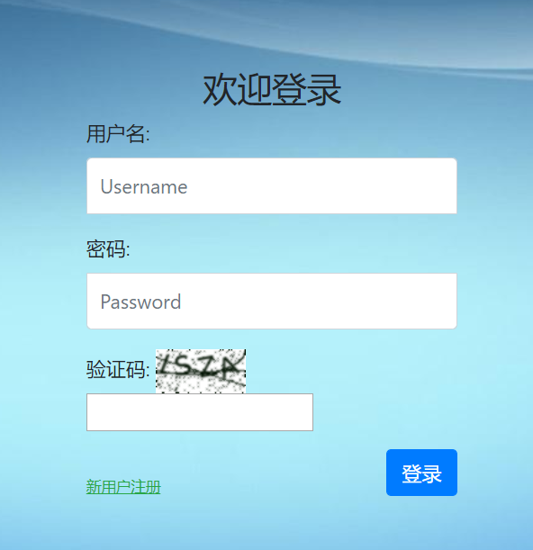
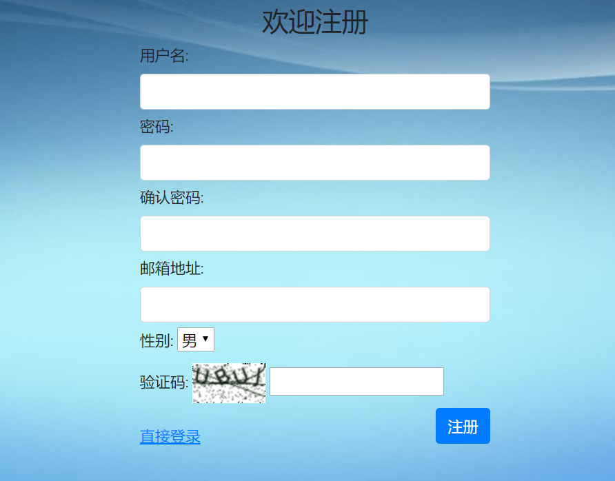

# 实战一：基于Django2.2可重用登录与注册系统

本项目是一个手把手，一步一步深入的教学项目，在此过程中，有些代码是临时性的，请务必仔细阅读完全文，不要断章取义，囫囵吞枣。

用户登录与注册系统非常具有代表性，适用面广，灵活性大，绝大多数项目都需要将其作为子系统之一。

本项目目的是打造一个针对管理系统、应用程序等需求下的可重用的登录/注册app，而不是门户网站、免费博客等无需登录即可访问的网站。

作为第一个实战项目，我会尽量讲解详细一些、啰嗦一些、通俗一些，手把手地教大家怎么分析问题、分解问题、解决问题，一步一步地由浅到深，由简单到复杂地将项目做得越来越好，越来越完善。在学习中，尤其是对于新手，我认为过程和结果一样重要，所以本项目中我不会直接将解决方案抛给你，而是将解决过程展现给你。

当然，在随后的实战项目中，就不会再如此详细地描述每一部分了，默认你已经对Django非常熟悉了。

****重要说明：****

​	1.本项目默认你已经有了一定的Python和Django基础；

​	2.这是一个教学项目，其中的代码和逻辑并不是严格适用于生产环境，或多或少存在缺陷，不要生搬照抄，必须根据你的实际环境进行修改。

登录界面展示：

注册界面展示：

好了，Let's go！