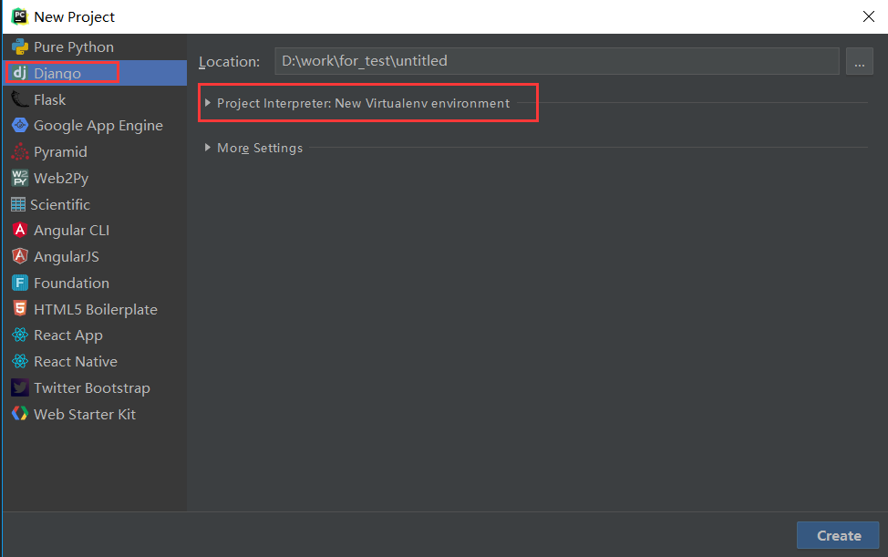
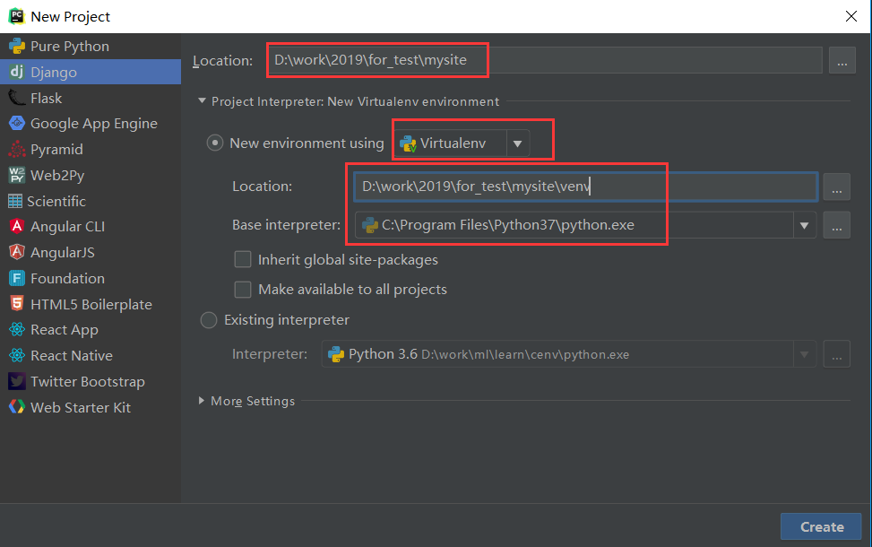
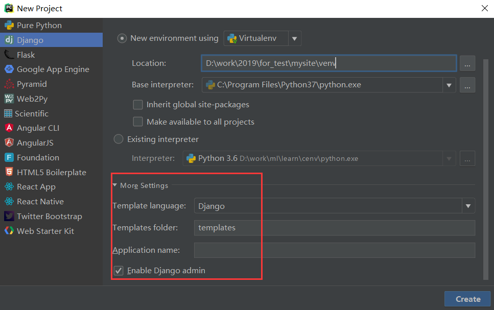
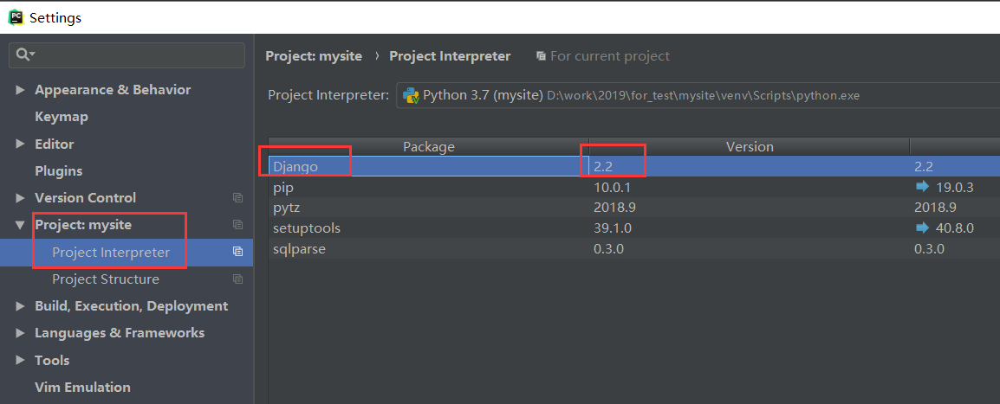
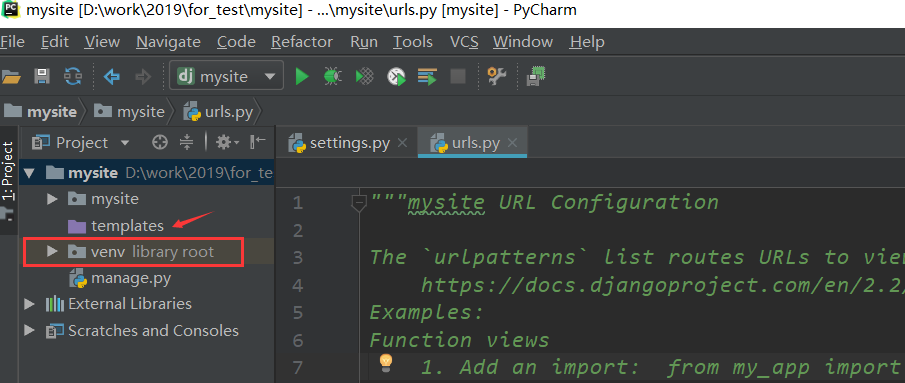
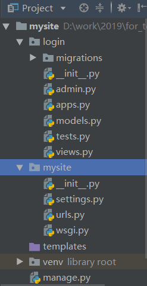
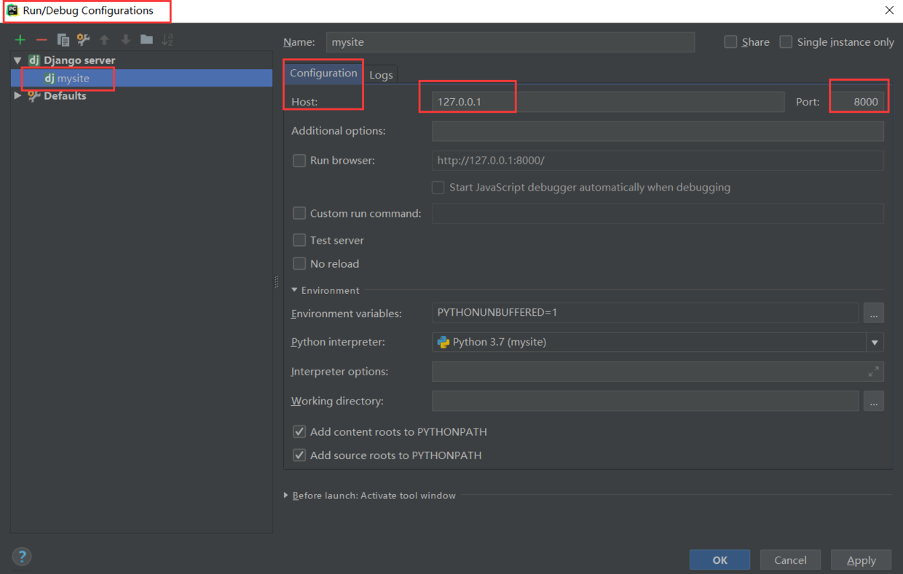
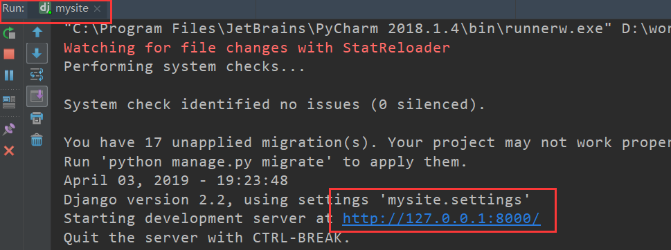
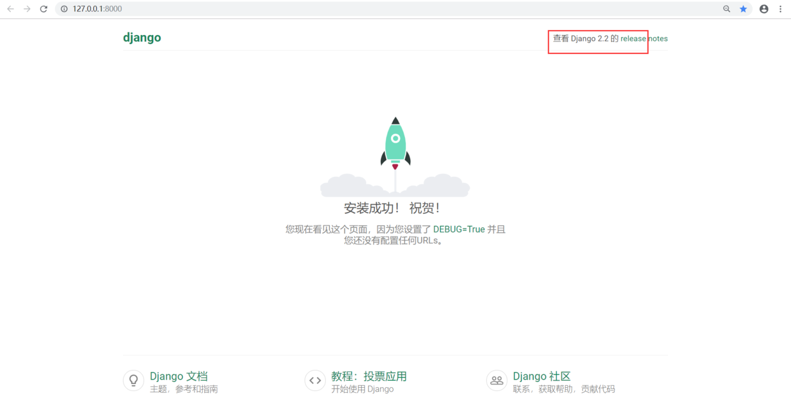

# 1.搭建项目环境

## 一、创建工程

当前，较新的Pycharm版本都支持同时创建虚拟环境和Django工程。所以我们下面的操作都在Pycharm中进行。

首先打开Pycharm，进入创建工程的对话框，注意下面的红框提示：



- 在Location处选择工程目录
- 在New environment using处选择Virtualenv（这可能需要你提前pip install virtualenv进行虚拟工具virtualenv的安装）。通常情况下，虚拟环境会以venv的名字，自动在工程目录下生成。
- 在Base interpreter处，选择你要使用的Python解释器
- 下面两个单选框，根据需要自行选择
- 如果想使用现成的解释器或者虚拟环境，请选择Existing interpreter



再点开下方的More Settings：

- Template language选择使用的模板语言，默认Django就行，可选Jinjia。
- Templates folder：Pycharm安利给我们的功能，额外创建一个工程级别的模板文件的保存目录，可以不设置，空着，这里使用默认设置吧。
- 启用Admin，一般勾上。



没什么问题了，就点击Create吧。

下面就是一段时间的等待，Pycharm会帮助我们自动创建虚拟环境，以及安装最新版本的Django。

创建完成之后，进入Pycharm的设置菜单，可以看到当前Django版本是最新的2.2版本。如果你要指定过去的版本，比如2.1、1.11等，那就不能这么操作了，需要在命令行下自己创建虚拟环境并安装django。或者在这里先删除Django，再安装你想要的指定版本。



看下我们当前的状态，注意venv这个虚拟环境目录，以及我们额外创建的templats目录：



## 二、创建app

点击Pycharm最下方工具栏中的Terminal按钮，进入终端界面，可以看到，我们已经在工程的根目录下，并且自动进入了虚拟环境内。（如果你不是通过Pycharm创建的虚拟环境，那么在这里，你可能需要手动激活虚拟环境。）

```
(venv) D:\work\2019\for_test\mysite>where python
D:\work\2019\for_test\mysite\venv\Scripts\python.exe
C:\Program Files\Python37\python.exe
C:\Program Files\Python36\python.exe
C:\Users\feixuelym\Anaconda3\python.exe

(venv) D:\work\2019\for_test\mysite>python -V
Python 3.7.3
```

接下来运行`python manage.py startapp login`创建login这个app。

按照上面的步骤操作完后，login应用就创建成功了，让我们看一下Pycharm中的目录结构：



## 三、 设置时区和语言

Django默认使用美国时间和英语，在项目的settings文件中，如下所示：

```
# Internationalization
# https://docs.djangoproject.com/en/1.11/topics/i18n/

LANGUAGE_CODE = 'en-us'

TIME_ZONE = 'UTC'

USE_I18N = True

USE_L10N = True

USE_TZ = True
```

我们把它改为`亚洲/上海`时间和中文（别问我为什么没有北京时间，也别把语言写成`zh-CN`），注意USE_TZ 改成False了。

```
# Internationalization
# https://docs.djangoproject.com/en/1.11/topics/i18n/

LANGUAGE_CODE = 'zh-hans'     # 这里修改了

TIME_ZONE = 'Asia/Shanghai'    # 这里修改了

USE_I18N = True

USE_L10N = True

USE_TZ = False    # 这里修改了
```

## 四、 启动开发服务器

现在，我们可以启动一下开发服务器，测试一下我们的工程了。

在Pycharm的`Run/Debug Configurations`配置界面里，将HOST设置为`127.0.0.1`，Port保持原样的`8000`，确定后，点击绿色三角，走你！



在本机的浏览器中访问`http://127.0.0.1:8000/`，或者点击Pycharm界面里的链接：



顺利的话，在浏览器中，你可以看到如下的欢迎界面：

