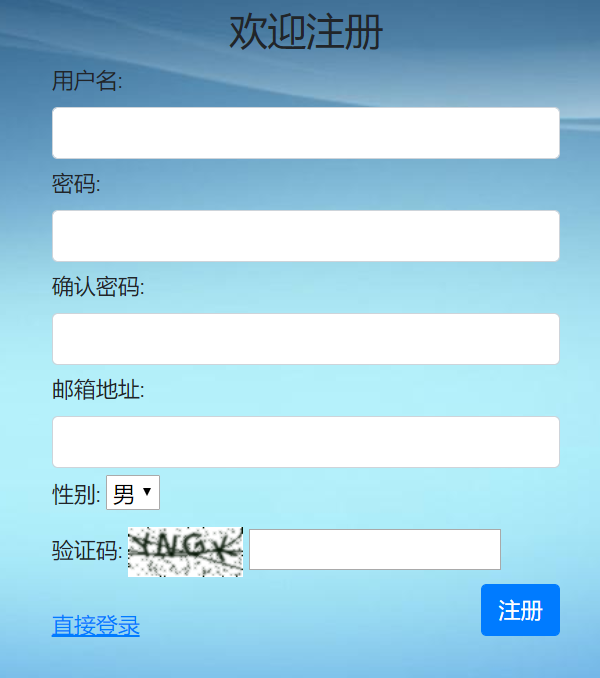
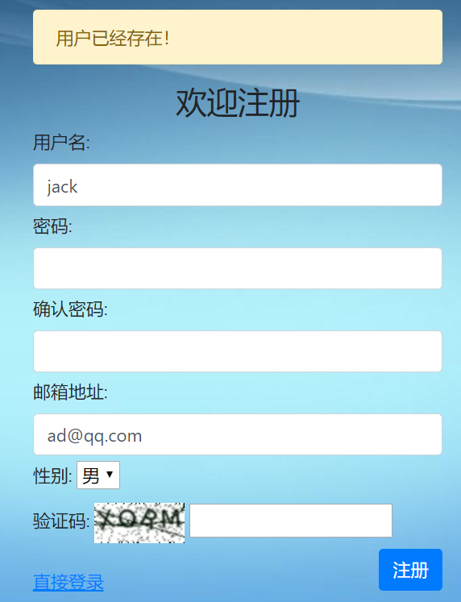
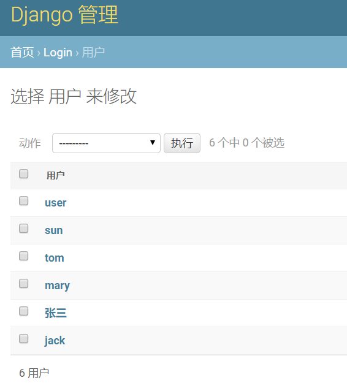
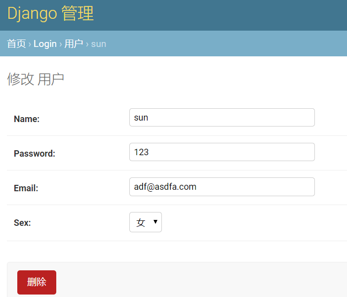
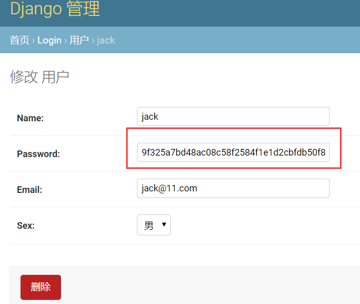

# 10. 注册视图

前面我们已经完成了项目大部分内容，现在还剩下重要的注册功能没有实现。

## 一、创建forms

显而易见，我们的注册页面也需要一个form表单。同样地，在`/login/forms.py`中添加一个新的表单类：

```
class RegisterForm(forms.Form):
    gender = (
        ('male', "男"),
        ('female', "女"),
    )
    username = forms.CharField(label="用户名", max_length=128, widget=forms.TextInput(attrs={'class': 'form-control'}))
    password1 = forms.CharField(label="密码", max_length=256, widget=forms.PasswordInput(attrs={'class': 'form-control'}))
    password2 = forms.CharField(label="确认密码", max_length=256, widget=forms.PasswordInput(attrs={'class': 'form-control'}))
    email = forms.EmailField(label="邮箱地址", widget=forms.EmailInput(attrs={'class': 'form-control'}))
    sex = forms.ChoiceField(label='性别', choices=gender)
    captcha = CaptchaField(label='验证码')
```

说明：

- gender字典和User模型中的一样，其实可以拉出来作为常量共用，为了直观，特意重写一遍；
- password1和password2，用于输入两遍密码，并进行比较，防止误输密码；
- email是一个邮箱输入框；
- sex是一个select下拉框；
- 没有添加更多的input属性

## 二、完善register.html

同样地，类似login.html文件，我们手工在register.html中编写forms相关条目：

```

<!doctype html>
<html lang="en">
  <head>
    <!-- Required meta tags -->
    <meta charset="utf-8">
    <meta name="viewport" content="width=device-width, initial-scale=1, shrink-to-fit=no">
    <!-- 上述meta标签*必须*放在最前面，任何其他内容都*必须*跟随其后！ -->
    <!-- Bootstrap CSS -->
    <link href="https://cdn.bootcss.com/twitter-bootstrap/4.3.1/css/bootstrap.min.css" rel="stylesheet">
    <link href="" rel="stylesheet"/>
    <title>注册</title>
  </head>
  <body>
    <div class="container">
            <div class="col">
                <form class="form-register" action="/register/" method="post">

                    
                        <div class="alert alert-warning">{{ register_form.captcha.errors }}</div>
                    
                        <div class="alert alert-warning">{{ message }}</div>
                    

                  
                  <h3 class="text-center">欢迎注册</h3>

                  <div class="form-group">
                      {{ register_form.username.label_tag }}
                      {{ register_form.username}}
                  </div>
                  <div class="form-group">
                      {{ register_form.password1.label_tag }}
                      {{ register_form.password1 }}
                  </div>
                  <div class="form-group">
                      {{ register_form.password2.label_tag }}
                      {{ register_form.password2 }}
                  </div>
                  <div class="form-group">
                      {{ register_form.email.label_tag }}
                      {{ register_form.email }}
                  </div>
                  <div class="form-group">
                      {{ register_form.sex.label_tag }}
                      {{ register_form.sex }}
                  </div>
                  <div class="form-group">
                      {{ register_form.captcha.label_tag }}
                      {{ register_form.captcha }}
                  </div>

                  <div>
                      <a href="/login/"  ><ins>直接登录</ins></a>
                      <button type="submit" class="btn btn-primary float-right">注册</button>
                  </div>
                </form>
            </div>
    </div> <!-- /container -->

    <!-- Optional JavaScript -->
    <!-- jQuery first, then Popper.js, then Bootstrap JS -->
    {#    以下三者的引用顺序是固定的#}
    <script src="https://cdn.bootcss.com/jquery/3.3.1/jquery.js"></script>
    <script src="https://cdn.bootcss.com/popper.js/1.15.0/umd/popper.js"></script>
    <script src="https://cdn.bootcss.com/twitter-bootstrap/4.3.1/js/bootstrap.min.js"></script>

  </body>
</html>
```

需要注意的是：

- 编写了一个register.css样式文件
- form标签的action地址为`/register/`，class为`form-register`
- from中传递过来的表单变量名字为`register_form`
- 最下面的链接修改为直接登录的链接

register.css样式文件的代码很简单，如下所示：

```
body {
  height: 100%;
  background-image: url('../image/bg.jpg');
}
.form-register {
  width: 100%;
  max-width: 400px;
  padding: 15px;
  margin: 0 auto;
}
.form-group {
  margin-bottom: 5px;
}
form a{
  display: inline-block;
  margin-top:25px;
  line-height: 10px;
}
```

## 三、实现注册视图

进入`/login/views.py`文件，现在来完善我们的`register()`视图：

```
def register(request):
    if request.session.get('is_login', None):
        return redirect('/index/')

    if request.method == 'POST':
        register_form = forms.RegisterForm(request.POST)
        message = "请检查填写的内容！"
        if register_form.is_valid():
            username = register_form.cleaned_data.get('username')
            password1 = register_form.cleaned_data.get('password1')
            password2 = register_form.cleaned_data.get('password2')
            email = register_form.cleaned_data.get('email')
            sex = register_form.cleaned_data.get('sex')

            if password1 != password2:
                message = '两次输入的密码不同！'
                return render(request, 'login/register.html', locals())
            else:
                same_name_user = models.User.objects.filter(name=username)
                if same_name_user:
                    message = '用户名已经存在'
                    return render(request, 'login/register.html', locals())
                same_email_user = models.User.objects.filter(email=email)
                if same_email_user:
                    message = '该邮箱已经被注册了！'
                    return render(request, 'login/register.html', locals())

                new_user = models.User()
                new_user.name = username
                new_user.password = password1
                new_user.email = email
                new_user.sex = sex
                new_user.save()

                return redirect('/login/')
        else:
            return render(request, 'login/register.html', locals())
    register_form = forms.RegisterForm()
    return render(request, 'login/register.html', locals())
```

从大体逻辑上，也是先实例化一个RegisterForm的对象，然后使用`is_valide()`验证数据，再从`cleaned_data`中获取数据。

重点在于注册逻辑，首先两次输入的密码必须相同，其次不能存在相同用户名和邮箱，最后如果条件都满足，利用ORM的API，创建一个用户实例，然后保存到数据库内。

对于注册的逻辑，不同的生产环境有不同的要求，请跟进实际情况自行完善，这里只是一个基本的注册过程，不能生搬照抄。

让我们看一下注册的页面：



你可以尝试用不同的情况进行注册，然后观察错误信息的提示:



最后进行一次成功地注册，会自动跳转到登录页面。我们进入admin后台，查看一下用户列表：






## 四、密码加密

等等！我们好像忘了什么！我们到现在都还一直在用明文的密码！

对于如何加密密码，有很多不同的途径，其安全程度也高低不等。这里我们使用Python内置的hashlib库，使用哈希值的方式加密密码，可能安全等级不够高，但足够简单，方便使用，不是么？

首先在`login/views.py`中编写一个hash函数：

```
import hashlib

def hash_code(s, salt='mysite'):# 加点盐
    h = hashlib.sha256()
    s += salt
    h.update(s.encode())  # update方法只接收bytes类型
    return h.hexdigest()
```

使用了sha256算法，加了点盐。

然后，我们还要对login()和register()视图进行一下修改：

```
from django.shortcuts import render
from django.shortcuts import redirect
from . import models
from . import forms
import hashlib
# Create your views here.


def hash_code(s, salt='mysite'):
    h = hashlib.sha256()
    s += salt
    h.update(s.encode())
    return h.hexdigest()


def index(request):
    if not request.session.get('is_login', None):
        return redirect('/login/')
    return render(request, 'login/index.html')


def login(request):
    if request.session.get('is_login', None):  # 不允许重复登录
        return redirect('/index/')
    if request.method == 'POST':
        login_form = forms.UserForm(request.POST)
        message = '请检查填写的内容！'
        if login_form.is_valid():
            username = login_form.cleaned_data.get('username')
            password = login_form.cleaned_data.get('password')

            try:
                user = models.User.objects.get(name=username)
            except :
                message = '用户不存在！'
                return render(request, 'login/login.html', locals())

            if user.password == hash_code(password):
                request.session['is_login'] = True
                request.session['user_id'] = user.id
                request.session['user_name'] = user.name
                return redirect('/index/')
            else:
                message = '密码不正确！'
                return render(request, 'login/login.html', locals())
        else:
            return render(request, 'login/login.html', locals())

    login_form = forms.UserForm()
    return render(request, 'login/login.html', locals())


def register(request):
    if request.session.get('is_login', None):
        return redirect('/index/')

    if request.method == 'POST':
        register_form = forms.RegisterForm(request.POST)
        message = "请检查填写的内容！"
        if register_form.is_valid():
            username = register_form.cleaned_data.get('username')
            password1 = register_form.cleaned_data.get('password1')
            password2 = register_form.cleaned_data.get('password2')
            email = register_form.cleaned_data.get('email')
            sex = register_form.cleaned_data.get('sex')

            if password1 != password2:
                message = '两次输入的密码不同！'
                return render(request, 'login/register.html', locals())
            else:
                same_name_user = models.User.objects.filter(name=username)
                if same_name_user:
                    message = '用户名已经存在'
                    return render(request, 'login/register.html', locals())
                same_email_user = models.User.objects.filter(email=email)
                if same_email_user:
                    message = '该邮箱已经被注册了！'
                    return render(request, 'login/register.html', locals())

                new_user = models.User()
                new_user.name = username
                new_user.password = hash_code(password1)
                new_user.email = email
                new_user.sex = sex
                new_user.save()

                return redirect('/login/')
        else:
            return render(request, 'login/register.html', locals())
    register_form = forms.RegisterForm()
    return render(request, 'login/register.html', locals())


def logout(request):
    if not request.session.get('is_login', None):
        return redirect('/login/')

    request.session.flush()
    # del request.session['is_login']
    return redirect("/login/")
```

注意其中关于密码处理的部分！

好了，我们可以来验证一下了!但是，**请先在admin后台里，把我们前面创建的测试用户全部删除！**因为它们的密码没有使用哈希算法加密，已经无效了。

重启服务器，进入注册页面，新建一个用户，然后进入admin后台，查看用户的密码情况：



再使用该用户登录一下，大功告成！

可以看到密码长度根据你哈希算法的不同，已经变得很长了，所以前面model中设置password字段时，不要想当然的将`max_length`设置为16这么小的数字。