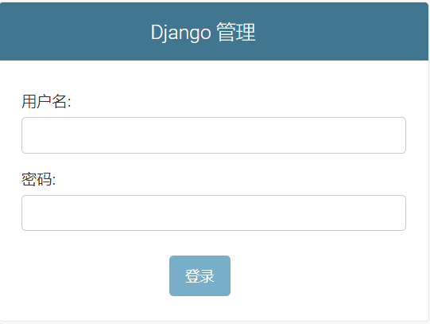
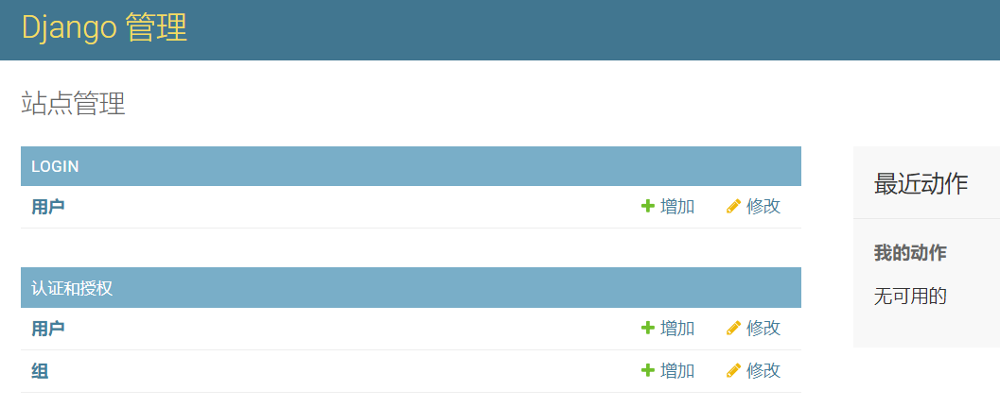
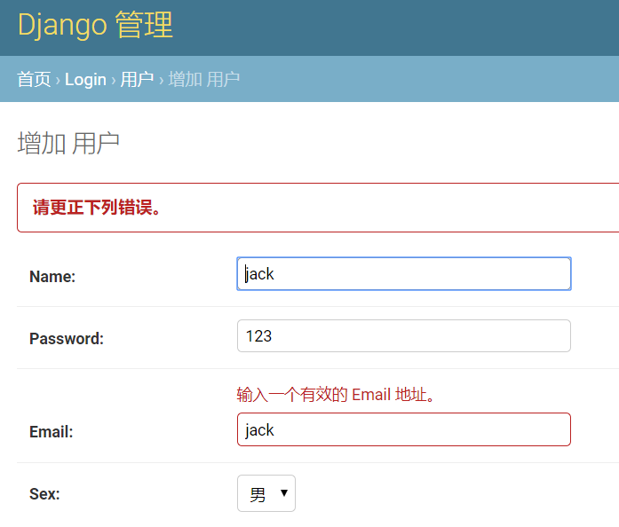
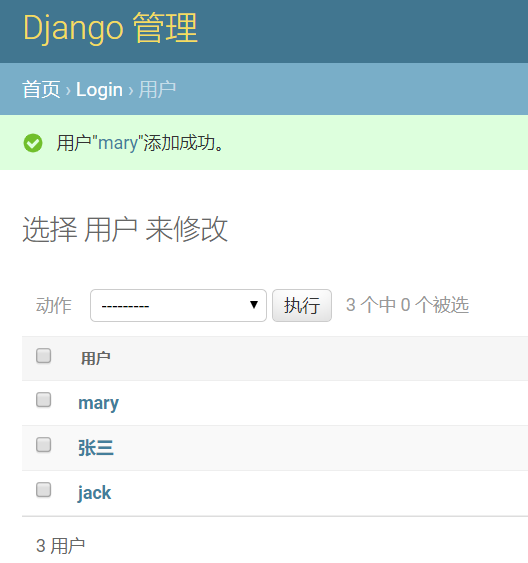

# 3. admin后台

在我们开发的初期，没有真实的用户数据，也没有完整的测试环境，为了测试和开发的方便，通常我们会频繁地使用Django给我们提供的Admin后台管理界面，创建测试用例，观察模型效果等等。

## 一、 在admin中注册模型

admin后台本质上是Django给我们提供的一个app，默认情况下，它已经在settings中注册了，如下所示的第一行！同样的还有session会话框架，后面我们会使用的。

```
# Application definition

INSTALLED_APPS = [
    'django.contrib.admin',     # 看这里
    'django.contrib.auth',
    'django.contrib.contenttypes',
    'django.contrib.sessions',      # 看这里
    'django.contrib.messages',
    'django.contrib.staticfiles',
    'login',
]
```

进入`login/admin.py`文件，代码如下：

```
from django.contrib import admin

# Register your models here.

from . import models

admin.site.register(models.User)
```

暂时简单点，直接注册就好了。

## 二、创建超级管理员

Django的admin后台拥有完整的较为安全的用户认证和授权机制，防护等级还算可以。

要进入该后台，需要创建超级管理员，该管理员和我们先前创建的User用户不是一个概念，要注意区别对待。

同样在Pycharm的终端中，执行下面的命令：

```
python manage.py createsuperuser
```

用户名、邮箱和密码请自行设定，但一定不要忘记。密码最好有一定强度，并且不能太简单和普遍，会有提示，我这里强制通过了。

```
(venv) D:\work\2019\for_test\mysite>python manage.py createsuperuser
用户名 (leave blank to use 'feixuelym'): admin
电子邮件地址: admin@admin.com
Password:
Password (again):
这个密码太常见了。
Bypass password validation and create user anyway? [y/N]: y
Superuser created successfully.
```

## 三、 使用Admin后台

创建好超级管理员后，就可以启动我们的开发服务器了，然后在浏览器中访问`http://127.0.0.1:8000/admin/`地址，可以看到如下的登录界面：



输入我们先前创建的超级管理员账户，进入管理界面：



注意，图中下方的`认证和授权`是admin应用自身的账户管理，上面的LOGIN栏目才是我们创建的login应用所对应的User模型。

点击Login栏目中的用户链接，进入用户列表界面，发现是空的，因为我们当前没有任何用户。点击右上方的增加用户按钮，我们创建几个测试用户试试：

通过输入不同的数据，我们看到Email会有地址合法性检查，性别有个选择框，非常的人性化。



但是，实际上这里还有点小问题，那就是密码相关。密码不能保存为明文，这个问题我们后面再解决；其次，不可以这么随意的修改和设置密码，为了展示的方便性，我们先这样。

这里我随便创建了三个测试账号，如下所示：



admin的使用和配置博大精深，但在本实战项目里，我们暂时把它当做一个数据库管理后台使用。

