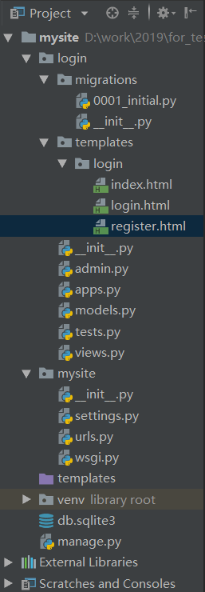
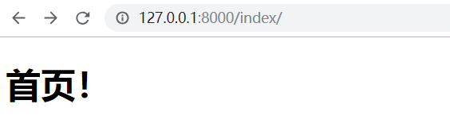

# 4. url路由和视图

前面我们已经创建好数据模型了，并且在admin后台中添加了一些测试用户。下面我们就要设计好站点的url路由、对应的处理视图函数以及使用的前端模板了。

## 一、 路由设计

我们初步设想需要下面的四个URL：

|  **URL**   |       **视图**       |    **模板**    | **说明** |
| :--------: | :------------------: | :------------: | :------: |
|  /index/   |  login.views.index   |   index.html   |   主页   |
|  /login/   |  login.views.login   |   login.html   |   登录   |
| /register/ | login.views.register | register.html  |   注册   |
|  /logout/  |  login.views.logout  | 无需专门的页面 |   登出   |

重要说明：由于本项目目的是打造一个针对管理系统、应用程序等需求下的可重用的登录/注册app，而不是门户网站、免费博客等无需登录即可访问的网站，所以在url路由、跳转策略和文件结构的设计上都是尽量自成体系。具体访问的策略如下：

- 未登录人员，不论是访问index还是login和logout，全部跳转到login界面
- 已登录人员，访问login会自动跳转到index页面
- 已登录人员，不允许直接访问register页面，需先logout
- 登出后，自动跳转到login界面

考虑到登录注册系统属于站点的一级功能，为了直观和更易于接受，这里没有采用二级路由的方式，而是在根路由下直接编写路由条目，同样也没有使用反向解析名（name参数）。所以，在重用本app的时候，一定要按照app使用说明，加入相应的url路由。

根据上面的策划，打开`mysite/urls.py`文件，写入下面的代码：

```
from django.contrib import admin
from django.urls import path
from login import views

urlpatterns = [
    path('admin/', admin.site.urls),
    path('index/', views.index),
    path('login/', views.login),
    path('register/', views.register),
    path('logout/', views.logout),
]
```

注意要先从login导入views模块。

## 二、 架构初步视图

路由写好了，就进入`login/views.py`文件编写视图的框架，代码如下：

```
from django.shortcuts import render
from django.shortcuts import redirect

# Create your views here.


def index(request):
    pass
    return render(request, 'login/index.html')


def login(request):
    pass
    return render(request, 'login/login.html')


def register(request):
    pass
    return render(request, 'login/register.html')


def logout(request):
    pass
    return redirect("/login/")
```

我们先不着急完成视图内部的具体细节，而是把框架先搭建起来。

注意：

- 在顶部额外导入了`redirect`，用于logout后，页面重定向到‘/login/’这个url，当然你也可以重定向到别的页面；
- 另外三个视图都返回一个render调用，render方法接收request作为第一个参数，要渲染的页面为第二个参数，以及需要传递给页面的数据字典作为第三个参数（可以为空），表示根据请求的部分，以渲染的HTML页面为主体，使用模板语言将数据字典填入，然后返回给用户的浏览器。
- 渲染的对象为login目录下的html文件，这是一种安全可靠的文件组织方式，我们现在还没有创建这些文件。

## 三、 创建HTML页面文件

在项目根路径的login目录中创建一个templates目录，再在templates目录里创建一个login目录。这么做有助于app复用，防止命名冲突，能更有效地组织大型工程，具体说明请参考教程前面的相关章节。

在`login/templates/login`目录中创建三个文件`index.html`、`login.html`以及`register.html` ，并写入如下的代码：

**`index.html`:**

```
<!DOCTYPE html>
<html lang="en">
<head>
    <meta charset="UTF-8">
    <title>首页</title>
</head>
<body>
<h1>这仅仅是一个主页模拟！请根据实际情况接入正确的主页！</h1>
</body>
</html>
```

**`login.html`:**

```
<!DOCTYPE html>
<html lang="en">
<head>
    <meta charset="UTF-8">
    <title>登录</title>
</head>
<body>
<h1>登录页面</h1>
</body>
</html>
```

**`register.html`**:

```
<!DOCTYPE html>
<html lang="en">
<head>
    <meta charset="UTF-8">
    <title>注册</title>
</head>
<body>
<h1>注册页面</h1>
</body>
</html>
```

到目前为止，我们的工程目录结构如下图所示：



## 四、 测试路由和视图

启动服务器，在浏览器访问`http://127.0.0.1:8000/index/`等页面，如果能正常显示，说明一切OK！



现在，我们整个项目的基本框架已经搭建起来了！