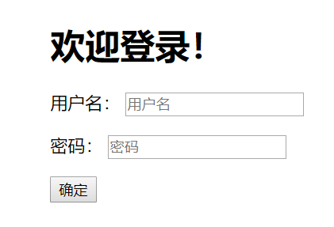
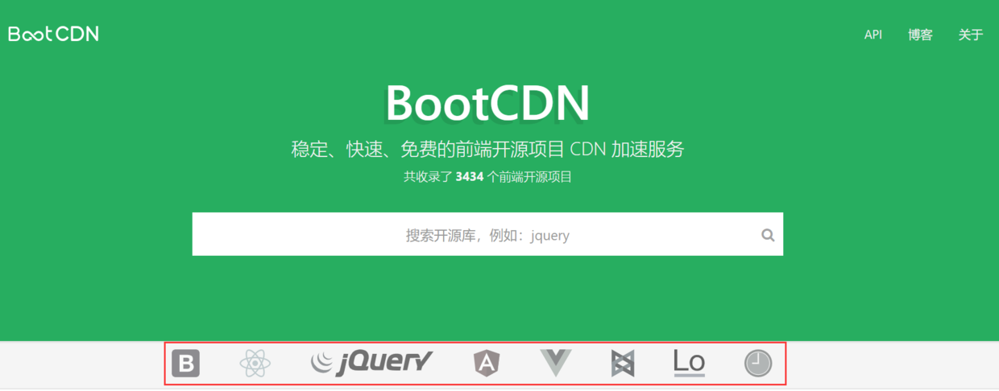
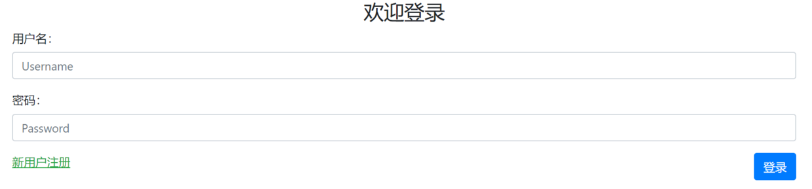
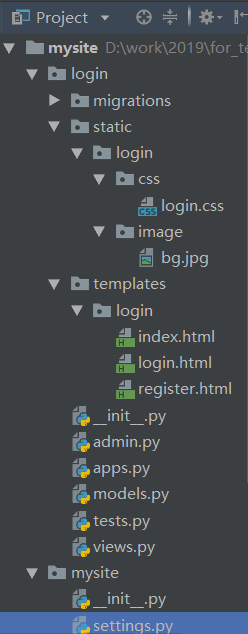
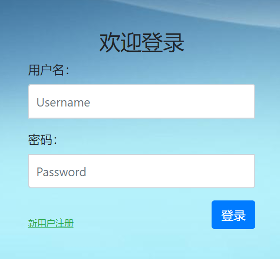

# 5. 前端页面设计

基本框架搭建好了后，我们就要开始丰富页面内容了。最起码，得有一个用户登录的表单不是么？（注册的事情我们先放一边。）

## 一、 使用原生HTML页面

删除原来的`login.html`文件中的内容，写入下面的代码：

```
<!DOCTYPE html>
<html lang="en">
<head>
    <meta charset="UTF-8">
    <title>登录</title>
</head>
<body>

    <div style="margin: 15% 40%;">
        <h1>欢迎登录！</h1>
       <form action="/login/" method="post">
            <p>
                <label for="id_username">用户名：</label>
                <input type="text" id="id_username" name="username" placeholder="用户名" autofocus required />
            </p>
            <p>
                <label for="id_password">密码：</label>
                <input type="password" id="id_password" placeholder="密码" name="password" required >
            </p>
            <input type="submit" value="确定">
        </form>
    </div>

</body>
</html>
```

简单解释一下：

- form标签主要确定目的地url和发送方法；
- p标签将各个输入框分行；
- label标签为每个输入框提供一个前导提示，还有助于触屏使用；
- placeholder属性为输入框提供占位符；
- autofocus属性为用户名输入框自动聚焦
- required表示该输入框必须填写
- passowrd类型的input标签不会显示明文密码

以上功能都是HTML5原生提供的，可以减少你大量的验证和JS代码，更详细的用法，请自行学习。

**特别声明：所有前端的验证和安全机制都是不可信的，恶意分子完全可以脱离浏览器伪造请求数据！**

启动服务器，访问`http://127.0.0.1:8000/login/`，可以看到如下图的页面：



## 二、引入Bootstrap 4

如果你的实际项目真的使用上面的那个页面外观，妥妥的被老板打死。代码虽然简单，速度虽然快，但没有CSS和JS，样子真的令人无法接受，在颜值即正义的年代，就是错误。

然而，大多数使用Django的人都不具备多高的前端水平，通常也没有专业的前端工程师配合，自己写的CSS和JS却又往往惨不忍睹。怎么办？没关系，我们有现成的开源前端CSS框架！Bootstrap4就是最好的CSS框架之一！

想要在HTML页面中使用Bootstrap4，最方便的方法就是使用国内外的免费CDN（如果app的使用环境不可以使用外部网络，也可以使用内部的CDN，或者静态文件）。

这里推荐BootCDN：https://www.bootcdn.cn/，速度比较快，有大量的不同版本的CDN。



这里直接给出HTML标签，复制粘贴即可：

```
CSS：

<link href="https://cdn.bootcss.com/twitter-bootstrap/4.3.1/css/bootstrap.min.css" rel="stylesheet">

以及JS：

<script src="https://cdn.bootcss.com/twitter-bootstrap/4.3.1/js/bootstrap.min.js"></script>
```

由于Bootstrap依赖JQuery，所以我们也需要使用CDN引用JQuery 3.3.1:

```
<script src="https://cdn.bootcss.com/jquery/3.3.1/jquery.js"></script>
```

另外，从Bootstrap4开始，额外需要popper.js的支持，依旧使用CDN的方式引入:

```
<script src="https://cdn.bootcss.com/popper.js/1.15.0/umd/popper.js"></script>
```

下面，我们就可以创建一个漂亮美观的登录页面了，具体代码如下：

```
<!doctype html>
<html lang="en">
  <head>
    <!-- Required meta tags -->
    <meta charset="utf-8">
    <meta name="viewport" content="width=device-width, initial-scale=1, shrink-to-fit=no">
    <!-- 上述meta标签*必须*放在最前面，任何其他内容都*必须*跟随其后！ -->
    <!-- Bootstrap CSS -->
    <link href="https://cdn.bootcss.com/twitter-bootstrap/4.3.1/css/bootstrap.min.css" rel="stylesheet">
    <title>登录</title>
  </head>
  <body>
    <div class="container">
            <div class="col">
              <form class="form-login" action="/login/" method="post">
                  <h3 class="text-center">欢迎登录</h3>
                  <div class="form-group">
                    <label for="id_username">用户名：</label>
                    <input type="text" name='username' class="form-control" id="id_username" placeholder="Username" autofocus required>
                  </div>
                  <div class="form-group">
                    <label for="id_password">密码：</label>
                    <input type="password" name='password' class="form-control" id="id_password" placeholder="Password" required>
                  </div>
                <div>
                  <a href="/register/" class="text-success "><ins>新用户注册</ins></a>
                  <button type="submit" class="btn btn-primary float-right">登录</button>
                </div>
              </form>
            </div>
    </div> <!-- /container -->

    <!-- Optional JavaScript -->
    <!-- jQuery first, then Popper.js, then Bootstrap JS -->
    {#    以下三者的引用顺序是固定的#}
    <script src="https://cdn.bootcss.com/jquery/3.3.1/jquery.js"></script>
    <script src="https://cdn.bootcss.com/popper.js/1.15.0/umd/popper.js"></script>
    <script src="https://cdn.bootcss.com/twitter-bootstrap/4.3.1/js/bootstrap.min.js"></script>

  </body>
</html>
```

访问一下login页面，看起来如下：



## 三、添加静态文件

然而，上面的登录页面在宽度上依然不太合适，背景也单调，所以一般我们会写一些CSS代码，同时使用背景图片。

在工程根目录下的login目录下，新建一个static目录，再到static目录里创建一个login目录，这种目录的创建方式和模板文件templates的创建方式都是一样的思维，也就是让重用app变得可能，并且不和其它的app发生文件路径和名称上的冲突。

继续在`/login/static/login`目录下创建一个css和一个image目录，css中添加我们为登录视图写的css文件，这里是`login.css`，image目录中，拷贝进来你想要的背景图片，这里是`bg.jpg`。最终目录结构如下：



下面我们修改一下login.html的代码，主要是引入了login.css文件，注意最开头的``，表示我们要加载静态文件。

```

<!doctype html>
<html lang="en">
  <head>
    <!-- Required meta tags -->
    <meta charset="utf-8">
    <meta name="viewport" content="width=device-width, initial-scale=1, shrink-to-fit=no">
    <!-- 上述meta标签*必须*放在最前面，任何其他内容都*必须*跟随其后！ -->
    <!-- Bootstrap CSS -->
    <link href="https://cdn.bootcss.com/twitter-bootstrap/4.3.1/css/bootstrap.min.css" rel="stylesheet">
    <link href="" rel="stylesheet"/>
    <title>登录</title>
  </head>
  <body>
    <div class="container">
            <div class="col">
              <form class="form-login" action="/login/" method="post">
                  <h3 class="text-center">欢迎登录</h3>
                  <div class="form-group">
                    <label for="id_username">用户名：</label>
                    <input type="text" name='username' class="form-control" id="id_username" placeholder="Username" autofocus required>
                  </div>
                  <div class="form-group">
                    <label for="id_password">密码：</label>
                    <input type="password" name='password' class="form-control" id="id_password" placeholder="Password" required>
                  </div>
                  <div>
                  <a href="/register/" class="text-success "><ins>新用户注册</ins></a>
                  <button type="submit" class="btn btn-primary float-right">登录</button>
                  </div>
              </form>
            </div>
    </div> <!-- /container -->

    <!-- Optional JavaScript -->
    <!-- jQuery first, then Popper.js, then Bootstrap JS -->
    {#    以下三者的引用顺序是固定的#}
    <script src="https://cdn.bootcss.com/jquery/3.3.1/jquery.js"></script>
    <script src="https://cdn.bootcss.com/popper.js/1.15.0/umd/popper.js"></script>
    <script src="https://cdn.bootcss.com/twitter-bootstrap/4.3.1/js/bootstrap.min.js"></script>

  </body>
</html>
```

而login.css文件的代码如下，注意其中背景图片bg.jpg的引用方式：

```
body {
  height: 100%;
  background-image: url('../image/bg.jpg');
}
.form-login {
  width: 100%;
  max-width: 330px;
  padding: 15px;
  margin: 0 auto;
}
.form-login{
  margin-top:80px;
  font-weight: 400;
}
.form-login .form-control {
  position: relative;
  box-sizing: border-box;
  height: auto;
  padding: 10px;
  font-size: 16px;

}
.form-login .form-control:focus {
  z-index: 2;
}
.form-login input[type="text"] {
  margin-bottom: -1px;
  border-bottom-right-radius: 0;
  border-bottom-left-radius: 0;
}
.form-login input[type="password"] {
  margin-bottom: 10px;
  border-top-left-radius: 0;
  border-top-right-radius: 0;
}
form a{
  display: inline-block;
  margin-top:25px;
  font-size: 12px;
  line-height: 10px;
}
```

好了，现在可以重启服务器，刷新登录页面，看看效果了：



以上关于前端的相关内容，实在难以一言述尽，需要大家具备一定的基础。做Django开发，其实就是全栈开发，没有一定的前端能力，很难做好。