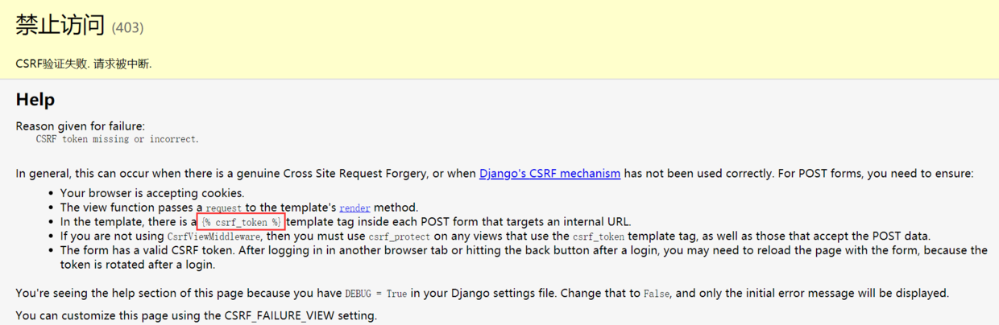
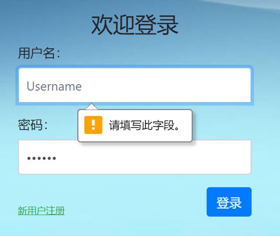
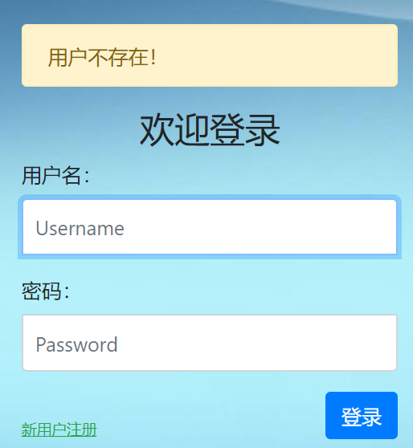
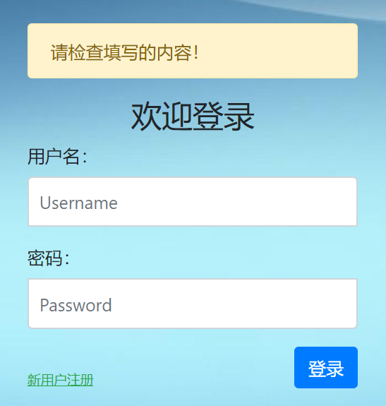

# 6. 登录视图

数据模型和前端页面我们都已经设计好了，是时候开始完善我们的登录视图具体内容了。

## 一、登录视图

根据我们在路由中的设计，用户通过`login.html`中的表单填写用户名和密码，并以POST的方式发送到服务器的`/login/`地址。服务器通过`login/views.py`中的`login()`视图函数，接收并处理这一请求。

我们可以通过下面的方法接收和处理请求：

```
def login(request):
    if request.method == "POST":
        username = request.POST.get('username')
        password = request.POST.get('password')
        print(username, password)
        return redirect('/index/')
    return render(request, 'login/login.html')
```

说明：

- 每个视图函数都至少接收一个参数，并且是第一位置参数，该参数封装了当前请求的所有数据；
- 通常将第一参数命名为request，当然也可以是别的；
- `request.method`中封装了数据请求的方法，如果是“POST”（全大写），将执行if语句的内容，如果不是，直接返回最后的render()结果，也就是正常的登录页面；
- `request.POST`封装了所有POST请求中的数据，这是一个字典类型，可以通过get方法获取具体的值。
- 类似`get('username')`中的键‘username’是HTML模板中表单的input元素里‘name’属性定义的值。所以在编写form表单的时候一定不能忘记添加name属性。
- 利用print函数在开发环境中验证数据；
- 利用redirect方法，将页面重定向到index页。

启动服务器，然后在`http://127.0.0.1:8000/login/`的表单中随便填入用户名和密码，然后点击提交。然而，页面却出现了错误提示，如下图所示：



错误原因是CSRF验证失败，请求被中断。CSRF（Cross-site request forgery）跨站请求伪造，是一种常见的网络攻击手段，具体原理和技术内容请自行百科。Django自带对许多常见攻击手段的防御机制，CSRF就是其中一种，还有XSS、SQL注入等。

解决这个问题的办法其实在Django的Debug错误页面已经给出了，我们需要在前端页面的form表单内添加一个``标签：

```
<form class="form-login" action="/login/" method="post">
                  
                  <h3 class="text-center">欢迎登录</h3>
                  <div class="form-group">
                    <label for="id_username">用户名：</label>
                    <input type="text" name='username' class="form-control" id="id_username" placeholder="Username" autofocus required>
                  </div>
                  <div class="form-group">
                    <label for="id_password">密码：</label>
                    <input type="password" name='password' class="form-control" id="id_password" placeholder="Password" required>
                  </div>
                  <div>
                  <a href="/register/" class="text-success " ><ins>新用户注册</ins></a>
                  <button type="submit" class="btn btn-primary float-right">登录</button>
                  </div>
                </form>
```

这个标签必须放在form表单内部，但是内部的位置可以随意。

重新刷新login页面，确保csrf的标签生效，然后再次输入内容并提交。这次就可以成功地在Pycharm开发环境中看到接收的用户名和密码，同时浏览器页面也跳转到了首页。

## 二、数据验证

前面我们提到过，要对用户发送的数据进行验证。数据验证分前端页面验证和后台服务器验证。前端验证可以通过专门的插件或者自己写JS代码实现，也可以简单地使用HTML5的新特性。这里，我们使用的是HTML5的内置验证功能，如下图所示：



它帮我们实现了下面的功能：

- 用户名和密码这类必填字段不能为空
- 密码部分用圆点替代

如果你还想要更强大和丰富的验证功能，比如限定密码长度不低于8位，用户名不能包含特殊字符等等，可以搜索并使用一些插件。

前端页面的验证都是用来给守法用户做提示和限制的，并不能保证绝对的安全，后端服务器依然要重新对数据进行验证。我们现在的视图函数，没有对数据进行任何的验证，如果你在用户名处输入个空格，是可以正常提交的，但这显然是不允许的。甚至，如果跳过浏览器伪造请求，那么用户名是None也可以发送过来。通常，除了数据内容本身，我们至少需要保证各项内容都提供了且不为空，对于用户名、邮箱、地址等内容往往还需要剪去前后的空白，防止用户未注意到的空格。

现在，让我们修改一下前面的代码：

```
def login(request):
    if request.method == "POST":
        username = request.POST.get('username')
        password = request.POST.get('password')
        if username.strip() and password:  # 确保用户名和密码都不为空      
            # 用户名字符合法性验证
            # 密码长度验证
            # 更多的其它验证.....
            return redirect('/index/')
    return render(request, 'login/login.html')
```

- get方法是Python字典类型的内置方法，它能够保证在没有指定键的情况下，返回一个None，从而确保当数据请求中没有username或password键时不会抛出异常；
- 通过`if username and password:`确保用户名和密码都不为空；
- 通过strip方法，将用户名前后无效的空格剪除；
- 更多的数据验证需要根据实际情况增加，原则是以最低的信任度对待发送过来的数据。

## 三、验证用户名和密码

数据形式合法性验证通过了，不代表用户就可以登录了，因为最基本的密码对比还未进行。

通过唯一的用户名，使用Django的ORM去数据库中查询用户数据，如果有匹配项，则进行密码对比，如果没有匹配项，说明用户名不存在。如果密码对比错误，说明密码不正确。

下面贴出当前状态下，/login/views.py中的全部代码，注意其中添加了一句`from . import models`，导入我们先前编写好的model模型。

```
from django.shortcuts import render
from django.shortcuts import redirect
from . import models
# Create your views here.


def index(request):
    pass
    return render(request, 'login/index.html')


def login(request):
    if request.method == "POST":
        username = request.POST.get('username')
        password = request.POST.get('password')
        if username.strip() and password:  # 确保用户名和密码都不为空
            # 用户名字符合法性验证
            # 密码长度验证
            # 更多的其它验证.....
            try:
                user = models.User.objects.get(name=username)
            except:
                return render(request, 'login/login.html')
            if user.password == password:
                return redirect('/index/')
    return render(request, 'login/login.html')


def register(request):
    pass
    return render(request, 'login/register.html')


def logout(request):
    pass
    return redirect("/login/")
```

说明：

- 首先要在顶部导入models模块；
- 使用try异常机制，防止数据库查询失败的异常；
- 如果未匹配到用户，则执行except中的语句；注意这里没有区分异常的类型，因为在数据库访问过程中，可能发生很多种类型的异常，我们要对用户屏蔽这些信息，不可以暴露给用户，而是统一返回一个错误提示，比如用户名不存在。这是大多数情况下的通用做法。当然，如果你非要细分，也不是不行。
- `models.User.objects.get(name=username)`是Django提供的最常用的数据查询API，具体含义和用法可以阅读前面的章节，不再赘述；
- 通过`user.password == password`进行密码比对，成功则跳转到index页面，失败则返回登录页面。

重启服务器，然后在登录表单内，使用错误的用户名和密码，以及我们先前在admin中创建的合法的测试用户，分别登录，看看效果。

## 四、 添加提示信息

上面的代码还缺少很重要的一部分内容，也就是错误提示信息！无论是登录成功还是失败，用户都没有得到任何提示信息，这显然是不行的。

修改一下login视图：

```
def login(request):
    if request.method == 'POST':
        username = request.POST.get('username')
        password = request.POST.get('password')
        message = '请检查填写的内容！'
        if username.strip() and password:
            # 用户名字符合法性验证
            # 密码长度验证
            # 更多的其它验证.....
            try:
                user = models.User.objects.get(name=username)
            except :
                message = '用户不存在！'
                return render(request, 'login/login.html', {'message': message})

            if user.password == password:
                print(username, password)
                return redirect('/index/')
            else:
                message = '密码不正确！'
                return render(request, 'login/login.html', {'message': message})
        else:
            return render(request, 'login/login.html', {'message': message})
    return render(request, 'login/login.html')
```

请仔细分析一下上面的登录和密码验证逻辑，以及错误提示的安排。

这里增加了message变量，用于保存提示信息。当有错误信息的时候，将错误信息打包成一个字典，然后作为第三个参数提供给render方法。这个数据字典在渲染模板的时候会传递到模板里供你调用。

为了在前端页面显示信息，还需要对`login.html`进行修改：

```
<form class="form-login" action="/login/" method="post">
                  
                    <div class="alert alert-warning">{{ message }}</div>
                  
                  
                  <h3 class="text-center">欢迎登录</h3>
                  <div class="form-group">
                    <label for="id_username">用户名：</label>
                    <input type="text" name='username' class="form-control" id="id_username" placeholder="Username" autofocus required>
                  </div>
                  <div class="form-group">
                    <label for="id_password">密码：</label>
                    <input type="password" name='password' class="form-control" id="id_password" placeholder="Password" required>
                  </div>
                  <div>
                  <a href="/register/" class="text-success " ><ins>新用户注册</ins></a>
                  <button type="submit" class="btn btn-primary float-right">登录</button>
                  </div>
                </form>
```

Django的模板语言``非常类似Python的if语句，也可以添加``分句。例子中，通过判断message变量是否为空，也就是是否有错误提示信息，如果有，就显示出来！这里使用了Bootstrap的警示信息类alert，你也可以自定义CSS或者JS。

好了，重启服务器，尝试用错误的和正确的用户名及密码登录，看看页面效果吧！下面是错误信息的展示：




