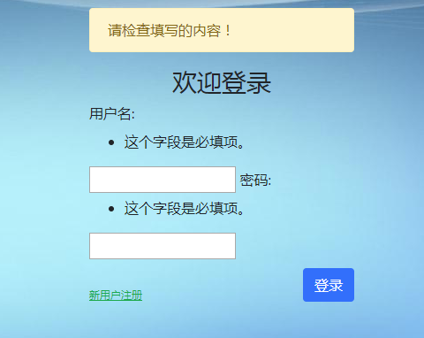
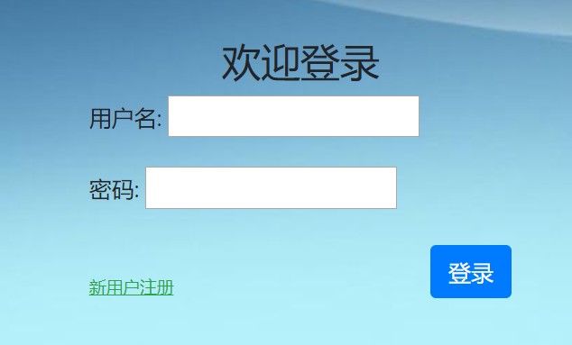
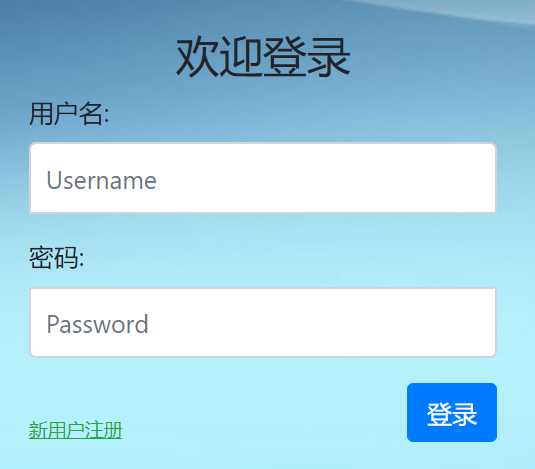

# 7. Django表单

我们前面都是手工在HTML文件中编写表单form元素，然后在views.py的视图函数中接收表单中的用户数据，再编写验证代码进行验证，最后使用ORM进行数据库的增删改查。这样费时费力，整个过程比较复杂，而且有可能写得不太恰当，数据验证也比较麻烦。设想一下，如果我们的表单拥有几十上百个数据字段，有不同的数据特点，如果也使用手工的方式，其效率和正确性都将无法得到保障。有鉴于此，Django在内部集成了一个表单功能，以面向对象的方式，直接使用Python代码生成HTML表单代码，专门帮助我们快速处理表单相关的内容。

Django的表单给我们提供了下面三个主要功能：

- 准备和重构数据用于页面渲染；
- 为数据创建HTML表单元素；
- 接收和处理用户从表单发送过来的数据。

编写Django的form表单，非常类似我们在模型系统里编写一个模型。在模型中，一个字段代表数据表的一列，而form表单中的一个字段代表`<form>`中的一个`<input>`元素。

## 一、创建表单模型

在项目根目录的login文件夹下，新建一个`forms.py`文件，也就是`/login/forms.py`，又是我们熟悉的Django组织文件的套路，一个app一套班子！

在`/login/forms.py`中写入下面的代码，是不是有一种编写数据model模型的既视感？

```
from django import forms


class UserForm(forms.Form):
    username = forms.CharField(label="用户名", max_length=128)
    password = forms.CharField(label="密码", max_length=256, widget=forms.PasswordInput)
```

说明：

- 顶部要先导入forms模块
- 所有的表单类都要继承forms.Form类
- 每个表单字段都有自己的字段类型比如CharField，它们分别对应一种HTML语言中`<form>`内的一个input元素。这一点和Django模型系统的设计非常相似。
- label参数用于设置`<label>`标签
- `max_length`限制字段输入的最大长度。它同时起到两个作用，一是在浏览器页面限制用户输入不可超过字符数，二是在后端服务器验证用户输入的长度也不可超过。
- `widget=forms.PasswordInput`用于指定该字段在form表单里表现为`<input type='password' />`，也就是密码输入框。

## 二、修改视图

使用了Django的表单后，就要在视图中进行相应的修改：

```
# login/views.py

from django.shortcuts import render
from django.shortcuts import redirect
from . import models
from . import forms
# Create your views here.


def index(request):
    pass
    return render(request, 'login/index.html')


def login(request):
    if request.method == 'POST':
        login_form = forms.UserForm(request.POST)
        message = '请检查填写的内容！'
        if login_form.is_valid():
            username = login_form.cleaned_data.get('username')
            password = login_form.cleaned_data.get('password')

            try:
                user = models.User.objects.get(name=username)
            except :
                message = '用户不存在！'
                return render(request, 'login/login.html', locals())

            if user.password == password:
                return redirect('/index/')
            else:
                message = '密码不正确！'
                return render(request, 'login/login.html', locals())
        else:
            return render(request, 'login/login.html', locals())

    login_form = forms.UserForm()
    return render(request, 'login/login.html', locals())


def register(request):
    pass
    return render(request, 'login/register.html')


def logout(request):
    pass
    return redirect("/login/")
```

说明：

- 在顶部要导入我们写的forms模块:`from . import forms`
- 对于非POST方法发送数据时，比如GET方法请求页面，返回空的表单，让用户可以填入数据；
- 对于POST方法，接收表单数据，并验证；
- 使用表单类自带的`is_valid()`方法一步完成数据验证工作；
- 验证成功后可以从表单对象的`cleaned_data`数据字典中获取表单的具体值；
- 如果验证不通过，则返回一个包含先前数据的表单给前端页面，方便用户修改。也就是说，它会帮你保留先前填写的数据内容，而不是返回一个空表！

另外，这里使用了一个小技巧，Python内置了一个locals()函数，它返回当前所有的本地变量字典，我们可以偷懒的将这作为render函数的数据字典参数值，就不用费劲去构造一个形如`{'message':message, 'login_form':login_form}`的字典了。这样做的好处当然是大大方便了我们，但是同时也可能往模板传入了一些多余的变量数据，造成数据冗余降低效率。

## 三、 修改login页面

Django的表单很重要的一个功能就是自动生成HTML的form表单内容。现在，我们需要修改一下原来的`login.html`文件：

```

<!doctype html>
<html lang="en">
  <head>
    <!-- Required meta tags -->
    <meta charset="utf-8">
    <meta name="viewport" content="width=device-width, initial-scale=1, shrink-to-fit=no">
    <!-- 上述meta标签*必须*放在最前面，任何其他内容都*必须*跟随其后！ -->
    <!-- Bootstrap CSS -->
    <link href="https://cdn.bootcss.com/twitter-bootstrap/4.3.1/css/bootstrap.min.css" rel="stylesheet">
    <link href="" rel="stylesheet"/>
    <title>登录</title>
  </head>
  <body>
    <div class="container">
            <div class="col">
                <form class="form-login" action="/login/" method="post">
                  
                    <div class="alert alert-warning">{{ message }}</div>
                  
                  
                  <h3 class="text-center">欢迎登录</h3>

                  {{ login_form }}

                  <div>
                      <a href="/register/" class="text-success " ><ins>新用户注册</ins></a>
                      <button type="submit" class="btn btn-primary float-right">登录</button>
                  </div>
                </form>
            </div>
    </div> <!-- /container -->

    <!-- Optional JavaScript -->
    <!-- jQuery first, then Popper.js, then Bootstrap JS -->
    {#    以下三者的引用顺序是固定的#}
    <script src="https://cdn.bootcss.com/jquery/3.3.1/jquery.js"></script>
    <script src="https://cdn.bootcss.com/popper.js/1.15.0/umd/popper.js"></script>
    <script src="https://cdn.bootcss.com/twitter-bootstrap/4.3.1/js/bootstrap.min.js"></script>

  </body>
</html>
```

上面贴了一个完整版的代码，方便大家对比参考。

说明：

- 你没有看错！一个`{{ login_form }}`就直接完成了表单内容的生成工作！`login_form`这个名称来自你在视图函数中生成的form实例的变量名！
- 但是，它不会生成`<form>...</form>`标签，这个要自己写；
- 使用POST的方法时，必须添加\{&#37; csrf_token &#37;\}标签，用于处理csrf安全机制；
- Django自动为每个input元素设置了一个id名称，对应label的for参数
- 注册链接和登录按钮需要自己写，Django不会帮你生成！

我们到浏览器中，看下实际生成的html源码是什么：

```
<form class="form-login" action="/login/" method="post"> 

  <input type="hidden" name="csrfmiddlewaretoken" value="5oJMX0z8PkUXY7RPDPGjaD2Q28CndXKeKWlftJD6s0XM1NIUEi7a0iET1NCYikUw"> 
  <h3 class="text-center">欢迎登录</h3>

  <tr><th><label for="id_username">用户名:</label></th><td><input type="text" name="username" maxlength="128" required id="id_username"></td></tr> 
  <tr><th><label for="id_password">密码:</label></th><td><input type="password" name="password" maxlength="256" required id="id_password"></td></tr> 
  <div> 
    <a href="[/register/](http://127.0.0.1:8000/register/)" class="text-success " ><ins>新用户注册</ins></a> 
    <button type="submit" class="btn btn-primary float-right">登录</button>
  </div> 
</form> 
```

也就是说，Django的form表单功能，帮你自动生成了下面部分的代码：

```
<tr><th><label for="id_username">用户名:</label></th><td><input type="text" name="username" maxlength="128" required id="id_username"></td></tr> 
<tr><th><label for="id_password">密码:</label></th><td><input type="password" name="password" maxlength="256" required id="id_password"></td></tr> 
```

这看起来好像一个`<table>`标签啊？没错，就是`<table>`标签，而且是不带`<table></table>`的，捂脸！

实际上除了通过`{{ login_form }}`简单地将表单渲染到HTML页面中了，还有下面几种方式：

- `{{ login_form.as_table }}` 将表单渲染成一个表格元素，每个输入框作为一个`<tr>`标签
- `{{ login_form.as_p }}` 将表单的每个输入框包裹在一个`<p>`标签内
- `{{ login_form.as_ul }}` 将表单渲染成一个列表元素，每个输入框作为一个`<li>`标签

注意：上面的渲染方法中都要自己手动编写`<table>`或者`<ul>`标签。

重新启动服务器，刷新页面，如下图所示：



## 四、手动渲染表单字段

直接`{{ login_form }}`虽然好，啥都不用操心，但是界面真的很丑，并且我们先前使用的Bootstraps4都没了。因为这些都需要对表单内的input元素进行额外控制，那怎么办呢？手动渲染字段就可以了！

可以通过`{{ login_form.name_of_field }}`获取每一个字段，然后分别渲染，如下例所示：

```
<div class="form-group">
  {{ login_form.username.label_tag }}
  {{ login_form.username}}
</div>
<div class="form-group">
  {{ login_form.password.label_tag }}
  {{ login_form.password }}
</div>
```

其中的label标签可以用`label_tag`方法来生成。这样子更加灵活了,但是灵活的代价就是我们要写更多的代码，又偏向原生的HTML代码多了一点。

但是问题又...又...又来了！刷新登录页面，却是下图的样子：



好像Bootstrap4没有生效呀！仔细查看最终生成的页面源码，你会发现，input元素里少了`form-control`的class，以及placeholder和autofocus，这可咋办？

在form类里添加attr属性即可，如下所示修改`login/forms.py`

```
from django import forms


class UserForm(forms.Form):
    username = forms.CharField(label="用户名", max_length=128, widget=forms.TextInput(attrs={'class': 'form-control', 'placeholder': "Username",'autofocus': ''}))
    password = forms.CharField(label="密码", max_length=256, widget=forms.PasswordInput(attrs={'class': 'form-control','placeholder': "Password"}))
```

再次刷新页面，我们熟悉的Bootstrap4框架UI又回来了！



实际上，Django针对`{{ login_form }}`表单，提供了很多灵活的模板语法，可以循环，可以取值，可以针对可见和不可见的部分单独控制。

