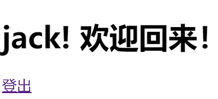

# 9. session会话

因为因特网HTTP协议的特性，每一次来自于用户浏览器的请求（request）都是无状态的、独立的。通俗地说，就是无法保存用户状态，后台服务器根本就不知道当前请求和以前及以后请求是否来自同一用户。对于静态网站，这可能不是个问题，而对于动态网站，尤其是京东、天猫、银行等购物或金融网站，无法识别用户并保持用户状态是致命的，根本就无法提供服务。你可以尝试将浏览器的cookie功能关闭，你会发现将无法在京东登录和购物。

为了实现连接状态的保持功能，网站会通过用户的浏览器在用户机器内被限定的硬盘位置中写入一些数据，也就是所谓的Cookie。通过Cookie可以保存一些诸如用户名、浏览记录、表单记录、登录和注销等各种数据。但是这种方式非常不安全，因为Cookie保存在用户的机器上，如果Cookie被伪造、篡改或删除，就会造成极大的安全威胁，因此，现代网站设计通常将Cookie用来保存一些不重要的内容，实际的用户数据和状态还是以Session会话的方式保存在服务器端。

但是，必须清楚的是**Session依赖Cookie**！不同的地方在于Session将所有的数据都放在服务器端，用户浏览器的Cookie中只会保存一个非明文的识别信息，比如哈希值。

Django提供了一个通用的Session框架，并且可以使用多种session数据的保存方式：

- 保存在数据库内
- 保存到缓存
- 保存到文件内
- 保存到cookie内

通常情况，没有特别需求的话，请使用保存在数据库内的方式，尽量不要保存到Cookie内。

Django的session框架默认启用，并已经注册在app设置内，如果真的没有启用，那么参考下面的内容添加有说明的那两行，再执行migrate命令创建数据表，就可以使用session了。

```
# Application definition

INSTALLED_APPS = [
    'django.contrib.admin',
    'django.contrib.auth',
    'django.contrib.contenttypes',
    'django.contrib.sessions',    # 这一行
    'django.contrib.messages',
    'django.contrib.staticfiles',
]

MIDDLEWARE = [
    'django.middleware.security.SecurityMiddleware',
    'django.contrib.sessions.middleware.SessionMiddleware',  # 这一行
    'django.middleware.common.CommonMiddleware',
    'django.middleware.csrf.CsrfViewMiddleware',
    'django.contrib.auth.middleware.AuthenticationMiddleware',
    'django.contrib.messages.middleware.MessageMiddleware',
    'django.middleware.clickjacking.XFrameOptionsMiddleware',
]
```

当session启用后，传递给视图request参数的HttpRequest对象将包含一个session属性，就像一个字典对象一样。你可以在Django的任何地方读写`request.session`属性，或者多次编辑使用它。

下面是session使用参考：

```
class backends.base.SessionBase
        # 这是所有会话对象的基类，包含标准的字典方法:
        __getitem__(key)
            Example: fav_color = request.session['fav_color']
        __setitem__(key, value)
            Example: request.session['fav_color'] = 'blue'
        __delitem__(key)
            Example: del request.session['fav_color']  # 如果不存在会抛出异常
        __contains__(key)
            Example: 'fav_color' in request.session
        get(key, default=None)
            Example: fav_color = request.session.get('fav_color', 'red')
        pop(key, default=__not_given)
            Example: fav_color = request.session.pop('fav_color', 'blue')
```

```
# 类似字典数据类型的内置方法
        keys()
        items()
        setdefault()
        clear()


        # 它还有下面的方法：
        flush()
            # 删除当前的会话数据和会话cookie。经常用在用户退出后，删除会话。

        set_test_cookie()
            # 设置一个测试cookie，用于探测用户浏览器是否支持cookies。由于cookie的工作机制，你只有在下次用户请求的时候才可以测试。
        test_cookie_worked()
            # 返回True或者False，取决于用户的浏览器是否接受测试cookie。你必须在之前先调用set_test_cookie()方法。
        delete_test_cookie()
            # 删除测试cookie。
        set_expiry(value)
            # 设置cookie的有效期。可以传递不同类型的参数值：
        • 如果值是一个整数，session将在对应的秒数后失效。例如request.session.set_expiry(300) 将在300秒后失效.
        • 如果值是一个datetime或者timedelta对象, 会话将在指定的日期失效
        • 如果为0，在用户关闭浏览器后失效
        • 如果为None，则将使用全局会话失效策略
        失效时间从上一次会话被修改的时刻开始计时。

        get_expiry_age()
            # 返回多少秒后失效的秒数。对于没有自定义失效时间的会话，这等同于SESSION_COOKIE_AGE.
            # 这个方法接受2个可选的关键字参数
        • modification:会话的最后修改时间（datetime对象）。默认是当前时间。
        •expiry: 会话失效信息，可以是datetime对象，也可以是int或None

        get_expiry_date()
            # 和上面的方法类似，只是返回的是日期

        get_expire_at_browser_close()
            # 返回True或False，根据用户会话是否是浏览器关闭后就结束。

        clear_expired()
            # 删除已经失效的会话数据。
        cycle_key()
            # 创建一个新的会话秘钥用于保持当前的会话数据。django.contrib.auth.login() 会调用这个方法。
```

基本上背下来上面的内容，Django的session你就可以信手拈来了。

## 一、使用session

下面结合我们的项目实战，使用session。

首先，修改`login/views.py`中的login()视图函数：

```
def login(request):
    if request.session.get('is_login', None):  # 不允许重复登录
        return redirect('/index/')
    if request.method == 'POST':
        login_form = forms.UserForm(request.POST)
        message = '请检查填写的内容！'
        if login_form.is_valid():
            username = login_form.cleaned_data.get('username')
            password = login_form.cleaned_data.get('password')

            try:
                user = models.User.objects.get(name=username)
            except :
                message = '用户不存在！'
                return render(request, 'login/login.html', locals())

            if user.password == password:
                request.session['is_login'] = True
                request.session['user_id'] = user.id
                request.session['user_name'] = user.name
                return redirect('/index/')
            else:
                message = '密码不正确！'
                return render(request, 'login/login.html', locals())
        else:
            return render(request, 'login/login.html', locals())

    login_form = forms.UserForm()
    return render(request, 'login/login.html', locals())
```

通过下面的if语句，我们不允许重复登录：

```
if request.session.get('is_login',None):
    return redirect("/index/")
```

通过下面的语句，我们往session字典内写入用户状态和数据：

```
request.session['is_login'] = True
request.session['user_id'] = user.id
request.session['user_name'] = user.name
```

你完全可以往里面写任何数据，不仅仅限于用户相关！

既然有了session记录用户登录状态，那么就可以完善我们的登出视图函数了：

```
def logout(request):
    if not request.session.get('is_login', None):
        # 如果本来就未登录，也就没有登出一说
        return redirect("/login/")
    request.session.flush()
    # 或者使用下面的方法
    # del request.session['is_login']
    # del request.session['user_id']
    # del request.session['user_name']
    return redirect("/login/")
```

flush()方法是比较安全的一种做法，而且一次性将session中的所有内容全部清空，确保不留后患。但也有不好的地方，那就是如果你在session中夹带了一点‘私货’，会被一并删除，这一点一定要注意。

## 二、在index页面中验证登录

有了用户状态，就可以根据用户登录与否，展示不同的页面，比如在index页面中显示当前用户的名称：

修改index.html的代码：

```
<!DOCTYPE html>
<html lang="en">
<head>
    <meta charset="UTF-8">
    <title>首页</title>
</head>
<body>
<h1>{{ request.session.user_name }}!  欢迎回来！</h1>
<p>
    <a href="/logout/">登出</a>
</p>
</body>
</html>
```

注意其中的模板语言，`{{ request }}`这个变量会被默认传入模板中，可以通过圆点的调用方式，获取它内部的`{{ request.session }}`，再进一步的获取session中的内容。其实`{{ request }}`中的数据远不止此，例如`{{ request.path }}`就可以获取先前的url地址。

重新启动服务器，进行登录和登出测试：



可以看出，在已经login的状态下，手动从浏览器地址栏中访问/login/也依然进入的是index页面。在logout的状态下，都会跳转到login页面。但是，需要注意的是，我们目前还没有编写index未登录限制访问的代码。

修改index视图函数，添加相关限制：

```
def index(request):
    if not request.session.get('is_login', None):
        return redirect('/login/')
    return render(request, 'login/index.html')
```