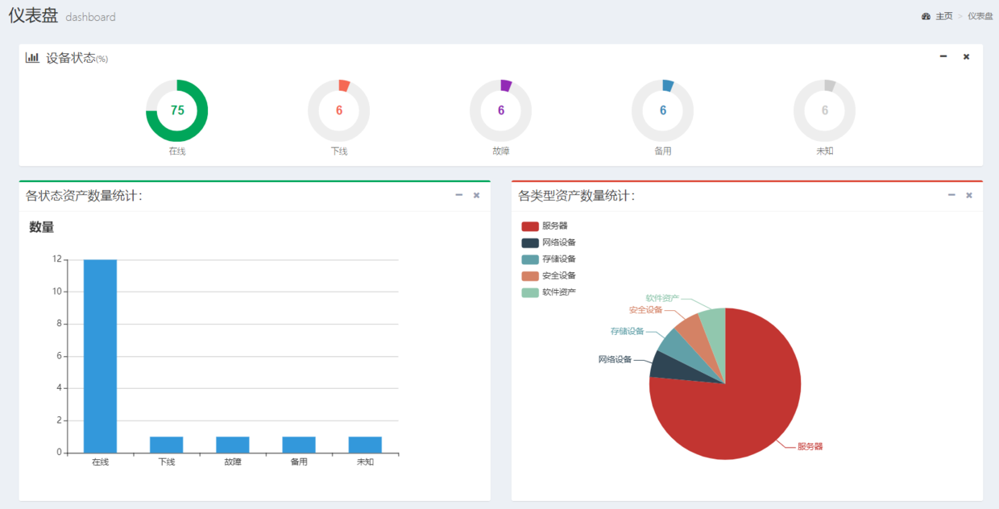
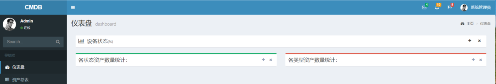
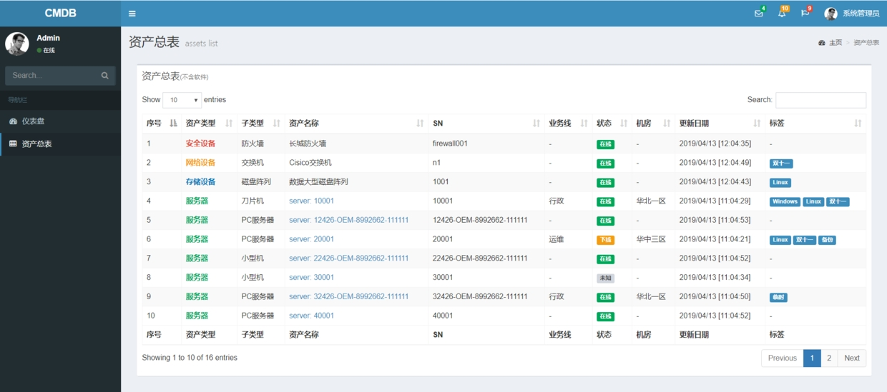
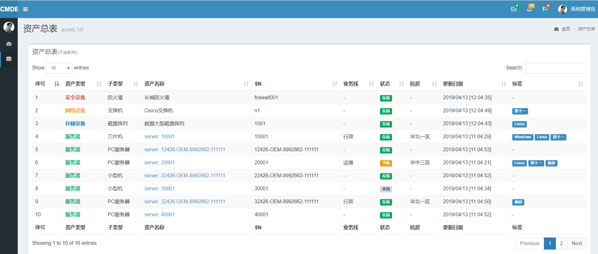
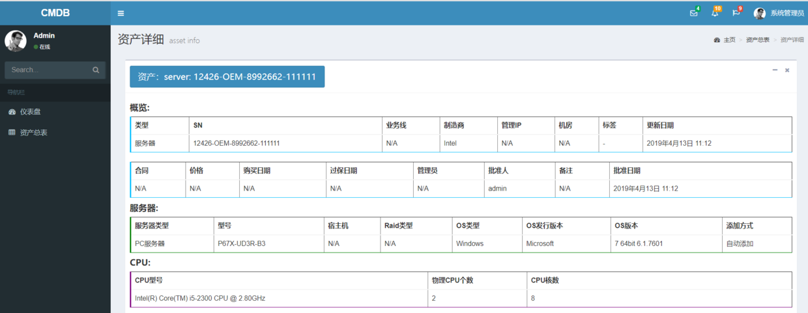
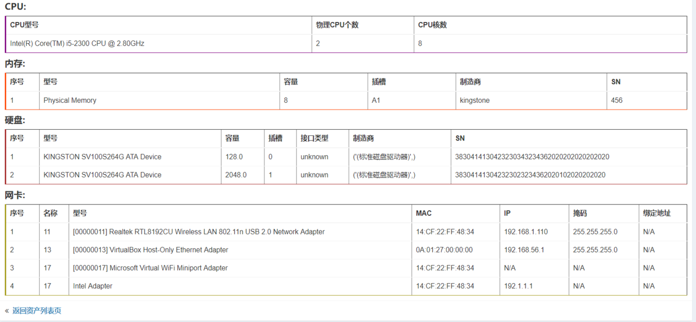

# 实战二：Django2.2之CMDB资产管理系统

## 一、概述

其实，一开始写这个实战项目，我是拒绝的，因为复杂，因为很多内容其实和Django无关，因为要考虑的问题太多。可是，如果不写一个有点含金量、贴近运维实际的项目，那么教程又流于形式，与一些不痛不痒的文章没什么区别。

**说明：本项目不是一个完整的CMDB系统，主要针对其最重要的资产管理系统。**

本实战项目主要是给大家提供一个基本思路和大致解决方案，而不是让你抄了代码就直接上线的。这里不考虑特别细的细节，也无法实现所有的业务逻辑，更不能作为考核的对象，所以请不要纠结这个地方应该是这样，那个地方不应该是那样的问题，而是关注原来CMDB是这么回事，可以通过哪种技术途径实现，大概要什么样的技术这些问题，主要的代码片段是哪些。

**整个项目最麻烦的就是数据的规格性、合法性、完整性和数据类型的验证**。不同的环境生成不同的数据，为了保证程序的健壮性，必须进行一系列的逻辑判断，这些都需要根据实际情况实际解决。作为一个教程的实战项目，不可能考虑得面面俱到，并且覆盖所有情况。**这里我默认客户端发送过来的数据是规整的，数据类型是正确的**。

**重要说明：**

1. 默认你已经有了一定的Python和Django基础；

## 二、项目展示

**仪表盘：**

**折叠状态的仪表盘：**

**资产总表：**

**侧边栏缩放的资产总表：**

**资产详细表一：**

**资产详细表二：**

项目的前端使用的是开源的AdminLTE 2.4.10模板，不仅美观大方，而且基于Bootstrap的特性，对移动设备和小屏端有很好的支持。