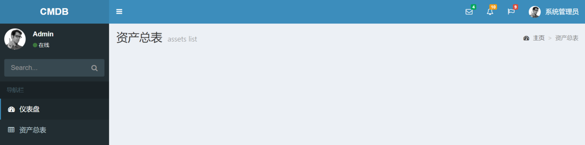
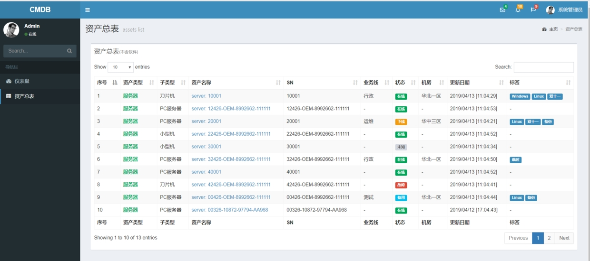

# 10.资产总表

当前，我们的资产总表如下图所示，还没有任何数据：



这需要我们从数据库中查询数据，然后渲染到前端页面中。

数据的获取很简单，一句`assets = models.Asset.objects.all()`就搞定。当然，你也可以设置过滤条件，添加分页等等。

而在前端，我们往往需要以表格的形式，规整、美观、可排序的展示出来。这里推荐一个前端插件datatables，是一个非常好的表格插件，功能强大、配置简单。

其官网为：https://datatables.net/ 中文网站：http://datatables.club/

在AdminLTE中，集成了datatables插件，无需额外下载和安装，直接引入使用就可以。

下面给出一个完整的index.html模板代码：

```


资产总表


 <link rel="stylesheet" href="">



<!-- Content Header (Page header) -->
    <section class="content-header">
      <h1>
        资产总表
        <small>assets list</small>
      </h1>
      <ol class="breadcrumb">
        <li><a href="#"><i class="fa fa-dashboard"></i> 主页</a></li>
        <li class="active">资产总表</li>
      </ol>
    </section>





    <!-- Main content -->
    <section class="content">
      <div class="row">
        <div class="col-xs-12">

        <div class="box">
        <div class="box-header">
          <h3 class="box-title">资产总表<small>(不含软件)</small></h3>
        </div>
        <!-- /.box-header -->
        <div class="box-body">
          <table id="assets_table" class="table table-bordered table-striped">
            <thead>
            <tr>
              <th>序号</th>
              <th>资产类型</th>
              <th>子类型</th>
              <th>资产名称</th>
              <th>SN</th>
              <th>业务线</th>
              <th>状态</th>
              <th>机房</th>
              <th>更新日期</th>
              <th>标签</th>
            </tr>
            </thead>
            <tbody>

                
                <tr>
                  <td>{{ forloop.counter }}</td>
                  
                      <td class="text-green text-bold">{{ asset.get_asset_type_display }}</td>
                      <td>{{ asset.server.get_sub_asset_type_display }}</td>
                  
                      <td class="text-yellow text-bold">{{ asset.get_asset_type_display }}</td>
                      <td>{{ asset.networkdevice.get_sub_asset_type_display }}</td>
                  
                      <td class="text-blue text-bold">{{ asset.get_asset_type_display }}</td>
                      <td>{{ asset.storagedevice.get_sub_asset_type_display }}</td>
                  
                      <td class="text-red text-bold">{{ asset.get_asset_type_display }}</td>
                      <td>{{ asset.securitydevice.get_sub_asset_type_display }}</td>
                  
                    
                        <td><a href="">{{ asset.name }}</a></td>
                    
                        <td>{{ asset.name }}</td>
                    
                  <td>{{ asset.sn }}</td>
                  <td>{{ asset.business_unit|default_if_none:"-" }}</td>
                    
                      <td><label class="label label-success">{{ asset.get_status_display }}</label></td>
                    
                      <td><label class="label label-warning">{{ asset.get_status_display }}</label></td>
                    
                      <td><label class="label label-default">{{ asset.get_status_display }}</label></td>
                    
                      <td><label class="label label-danger">{{ asset.get_status_display }}</label></td>
                    
                      <td><label class="label label-info">{{ asset.get_status_display }}</label></td>
                    
                  <td>{{ asset.idc|default:"-" }}</td>
                  <td>{{ asset.m_time|date:"Y/m/d [H:m:s]" }}</td>
                  <td>
                      
                        <label class="label label-primary">{{ tag.name }}</label>
                      
                          -
                      
                  </td>
                </tr>
                
                  <tr>没有数据！</tr>
                

            </tbody>
            <tfoot>
            <tr>
              <th>序号</th>
              <th>资产类型</th>
              <th>子类型</th>
              <th>资产名称</th>
              <th>SN</th>
              <th>业务线</th>
              <th>状态</th>
              <th>机房</th>
              <th>更新日期</th>
              <th>标签</th>
            </tr>
            </tfoot>
          </table>
        </div>
        <!-- /.box-body -->
      </div>
      <!-- /.box -->
        </div>
    <!-- /.col -->
      </div>
    <!-- /.row -->
    </section>







<script src=""></script>
<script src=""></script>

<script>
$(function () {
        $('#assets_table').DataTable({
          "paging": true,       <!-- 允许分页 -->
          "lengthChange": true, <!-- 允许改变每页显示的行数 -->
          "searching": true,    <!-- 允许内容搜索 -->
          "ordering": true,     <!-- 允许排序 -->
          "info": true,         <!-- 显示信息 -->
          "autoWidth": false    <!-- 固定宽度 -->
        });
      });
</script>



```

**首先我们导入了datatables需要的CSS和JS文件。**

主要是新增了表格相关的html代码和初始化表格的js代码。

`<table id="assets_table" class="table table-bordered table-striped">`中的id属性非常重要，用于关联相应的初始化js代码。

表格中，循环每一个资产：

- 首先生成一个排序的列；
- 再根据资产类型的不同，用不同的颜色生成不同的资产类型名和子类型名；
- 通过\{\{ asset.get_asset_type_display \}\}的模板语法，拿到资产类型的直观名称，比如‘服务器’，而不是显示呆板的‘server’；
- 通过\{\{ asset.server.get_sub_asset_type_display \}\}，获取资产对应类型的子类型。这是Django特有的模板语法，非常类似其ORM的语法；
- 在资产名的栏目，增加了超级链接，用于显示资产的详细内容。这里只实现了服务器类型资产的详细页面，其它类型请自行完善。注意其中使用`url`模板标签，实现自动的详细页面url地址生成；
- 根据资产状态的不同，用不同的颜色显示；
- 利用\{\{ asset.m_time|date:"Y/m/d [H:m:s]" \}\}调整时间的显示格式；
- 由于资产和tas标签属于多对多的关系，所以需要一个循环，遍历每个tas并打印其名称；
- 通过`asset.tags.all`可以获取一个资产对应的多对多字段的全部对象，很类似ORM的做法。

表格的初始化JS代码如下：

```
<script>
  $(function () {
    $('#assets_table').DataTable({
      "paging": true,       <!-- 允许分页 -->
      "lengthChange": true, <!-- 允许改变每页显示的行数 -->
      "searching": true,    <!-- 允许内容搜索 -->
      "ordering": true,     <!-- 允许排序 -->
      "info": true,         <!-- 显示信息 -->
      "autoWidth": false    <!-- 固定宽度 -->
    });
  });
</script>
```

其中可定义是否允许分页、改变显示的行数、搜索、排序、显示信息、固定宽度等等，通过表格的id进行关联。

下面，我们通过后台admin界面，多增加几个服务器实例，并修改其子类型、业务线、状态、机房、标签，再刷新资产总表，可以看到效果如下：



试着使用一下排序和搜索功能吧！datatables还是相当强大的！

现在点击资产名称，可以链接到资产详细页面，但没有任何数据显示，在下一节中，我们来实现它。