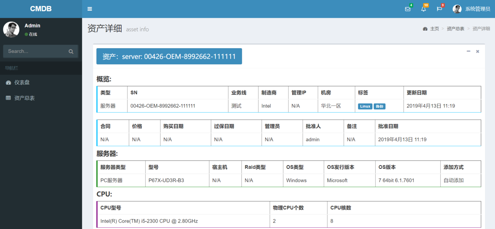
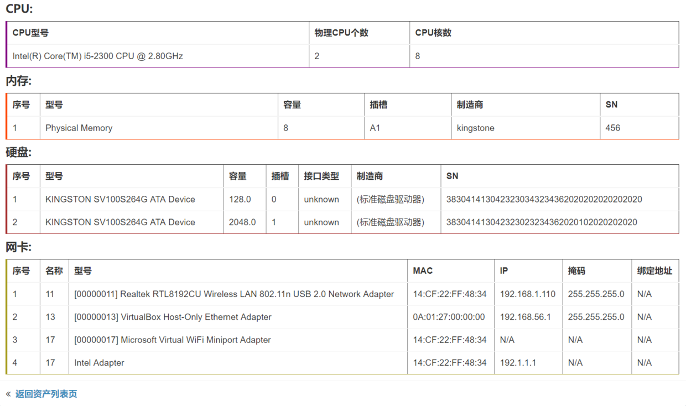

# 11.资产详细页面

在资产的详细页面，我们将尽可能地将所有的信息都显示出来，并保持美观、整齐。

教程中实现了主要的服务器资产页面，对于其它类型的资产详细页面，可参照完成，并不复杂。

完整的detail.html页面代码如下：

```


资产详细






<!-- Content Header (Page header) -->
    <section class="content-header">
      <h1>
        资产详细
        <small>asset info</small>
      </h1>
      <ol class="breadcrumb">
        <li><a href="#"><i class="fa fa-dashboard"></i> 主页</a></li>
        <li>资产总表</li>
        <li class="active">资产详细</li>
      </ol>
    </section>




    <!-- Main content -->
    <section class="content">

      <!-- Default box -->
      <div class="box">

          <div class="box-header with-border">
          <h3 class="box-title"><strong class="btn btn-block btn-primary btn-lg">资产：{{ asset.name }}</strong></h3>

          <div class="box-tools pull-right">
            <button type="button" class="btn btn-box-tool" data-widget="collapse" data-toggle="tooltip" title="Collapse">
              <i class="fa fa-minus"></i></button>
            <button type="button" class="btn btn-box-tool" data-widget="remove" data-toggle="tooltip" title="Remove">
              <i class="fa fa-times"></i></button>
          </div>
        </div>

          <div class="box-body">
          <h4><b>概览:</b></h4>
            <table border="1" class="table  table-responsive" style="border-left:3px solid deepskyblue;border-bottom:1px solid deepskyblue" >
                <thead>
                    <tr>
                        <th>类型</th>
                        <th>SN</th>
                        <th>业务线</th>
                        <th>制造商</th>
                        <th>管理IP</th>
                        <th>机房</th>
                        <th>标签</th>
                        <th>更新日期</th>
                    </tr>
                </thead>
                <tbody>
                <tr>
                    <td>{{ asset.get_asset_type_display }}</td>
                    <td>{{ asset.sn }}</td>
                    <td>{{ asset.business_unit|default:'N/A' }}</td>
                    <td>{{ asset.manufacturer|default:'N/A' }}</td>
                    <td>{{ asset.manage_ip|default:'N/A' }}</td>
                    <td>{{ asset.idc|default:'N/A' }}</td>
                    <td>
                        
                        <label class="label label-primary">{{ tag.name }}</label>
                        
                            -
                        
                    </td>
                    <td>{{ asset.m_time }}</td>
                </tr>
                </tbody>
            </table>
            <br />
            <table border="1" class="table  table-responsive" style="border-left:3px solid deepskyblue;border-bottom:1px solid deepskyblue">
                <thead>
                    <tr>
                        <th>合同</th>
                        <th>价格</th>
                        <th>购买日期</th>
                        <th>过保日期</th>
                        <th>管理员</th>
                        <th>批准人</th>
                        <th>备注</th>
                        <th>批准日期</th>
                    </tr>
                </thead>
                <tbody>
                <tr>
                    <td>{{ asset.contract.name|default:'N/A' }}</td>
                    <td>{{ asset.price|default:'N/A' }}</td>
                    <td>{{ asset.purchase_day|default:'N/A' }}</td>
                    <td>{{ asset.expire_day|default:'N/A' }}</td>
                    <td>{{ asset.admin|default:'N/A' }}</td>
                    <td>{{ asset.approved_by|default:'N/A' }}</td>
                    <td>{{ asset.memo|default:'N/A' }}</td>
                    <td>{{ asset.m_time }}</td>
                </tr>
                </tbody>
            </table>
          <h4><b>服务器:</b></h4>
            <table border="1" class="table  table-responsive" style="border-left:3px solid green;border-bottom:1px solid green">
                <thead>
                    <tr>
                        <th>服务器类型</th>
                        <th>型号</th>
                        <th>宿主机</th>
                        <th>Raid类型</th>
                        <th>OS类型</th>
                        <th>OS发行版本</th>
                        <th>OS版本</th>
                        <th>添加方式</th>
                    </tr>
                </thead>
                <tbody>
                <tr>
                    <td>{{ asset.server.get_sub_asset_type_display }}</td>
                    <td>{{ asset.server.model|default:'N/A' }}</td>
                    <td>{{ asset.server.hosted_on.id|default:'N/A' }}</td>
                    <td>{{ asset.server.raid_type|default:'N/A' }}</td>
                    <td>{{ asset.server.os_type|default:'N/A' }}</td>
                    <td>{{ asset.server.os_distribution|default:'N/A' }}</td>
                    <td>{{ asset.server.os_release|default:'N/A' }}</td>
                    <td>{{ asset.server.get_created_by_display }}</td>
                </tr>
                </tbody>
            </table>
        <h4><b>CPU:</b></h4>
            <table border="1" class="table  table-responsive" style="border-left:3px solid purple;border-bottom:1px solid purple">
                <thead>
                    <tr>
                        <th  style="width: 45%">CPU型号</th>
                        <th  style="width: 15%">物理CPU个数</th>
                        <th>CPU核数</th>
                    </tr>
                </thead>
                <tbody>
                <tr>
                    <td>{{ asset.cpu.cpu_model|default:'N/A' }}</td>
                    <td>{{ asset.cpu.cpu_count|default:'1' }}</td>
                    <td>{{ asset.cpu.cpu_core_count|default:'1' }}</td>
                </tr>
                </tbody>
            </table>
        <h4><b>内存:</b></h4>
        <table border="1" class="table  table-responsive" style="border-left:3px solid orangered;border-bottom:1px solid orangered">
                <thead>
                    <tr>
                        <th style="width:5%;">序号</th>
                        <th>型号</th>
                        <th>容量</th>
                        <th>插槽</th>
                        <th>制造商</th>
                        <th>SN</th>
                    </tr>
                </thead>
                <tbody>
                
                    <tr>
                        <td>{{ forloop.counter }}</td>
                        <td>{{ ram.model|default:'N/A' }}</td>
                        <td>{{ ram.capacity|default:'N/A' }}</td>
                        <td>{{ ram.slot }}</td>
                        <td>{{ ram.manufacturer|default:'N/A' }}</td>
                        <td>{{ ram.sn|default:'N/A' }}</td>
                    </tr>
                
                    <tr>
                        <td></td><td></td><td></td><td></td><td></td><td></td>
                    </tr>
                
                </tbody>
            </table>
        <h4><b>硬盘:</b></h4>
        <table border="1" class="table  table-responsive" style="border-left:3px solid brown;border-bottom:1px solid brown">
                <thead>
                    <tr>
                        <th style="width:5%;">序号</th>
                        <th>型号</th>
                        <th>容量</th>
                        <th>插槽</th>
                        <th>接口类型</th>
                        <th>制造商</th>
                        <th>SN</th>
                    </tr>
                </thead>
                <tbody>
                
                    <tr>
                        <td>{{ forloop.counter }}</td>
                        <td>{{ disk.model|default:'N/A' }}</td>
                        <td>{{ disk.capacity|default:'N/A' }}</td>
                        <td>{{ disk.slot|default:'N/A'  }}</td>
                        <td>{{ disk.get_interface_type_display }}</td>
                        <td>{{ disk.manufacturer|default:'N/A' }}</td>
                        <td>{{ disk.sn}}</td>
                    </tr>
                
                    <tr>
                        <td></td><td></td><td></td><td></td><td></td><td></td><td></td>
                    </tr>
                
                </tbody>
            </table>
        <h4><b>网卡:</b></h4>
        <table border="1" class="table  table-responsive" style="border-left:3px solid #a59b1a;border-bottom:1px solid #a59b1a">
                <thead>
                    <tr>
                        <th style="width:5%;">序号</th>
                        <th>名称</th>
                        <th>型号</th>
                        <th>MAC</th>
                        <th>IP</th>
                        <th>掩码</th>
                        <th>绑定地址</th>
                    </tr>
                </thead>
                <tbody>
                
                    <tr>
                        <td>{{ forloop.counter }}</td>
                        <td>{{ nic.name|default:'N/A' }}</td>
                        <td>{{ nic.model }}</td>
                        <td>{{ nic.mac  }}</td>
                        <td>{{ nic.ip_address|default:'N/A' }}</td>
                        <td>{{ nic.net_mask|default:'N/A' }}</td>
                        <td>{{ nic.bonding|default:'N/A' }}</td>
                    </tr>
                
                    <tr>
                        <td></td><td></td><td></td><td></td><td></td><td></td><td></td>
                    </tr>
                
                </tbody>
            </table>

        </div>
        <!-- /.box-body -->
        <div class="box-footer">
          <i class="fa fa-angle-double-left"></i>&nbsp;&nbsp;<a href=""><strong>返回资产列表页</strong></a>
        </div>
        <!-- /.box-footer-->
      </div>
      <!-- /.box -->

    </section>
    <!-- /.content -->






```

主要代码全部集中在`<section class="content">`里，分别用几个表格将概览、服务器、CPU、内存、硬盘和网卡的信息展示出来了。并且，AdminLTE为我们提供了一个折叠的功能，也是非常酷的。

这个HTML文件没有太多需要额外解释的内容，都是一些很基础的模板语言，构造`<table>`，然后插入数据。如果没有数据，就以‘N/A’代替。最后在底部添加一个返回资产总表的链接。

下面是展示图：




