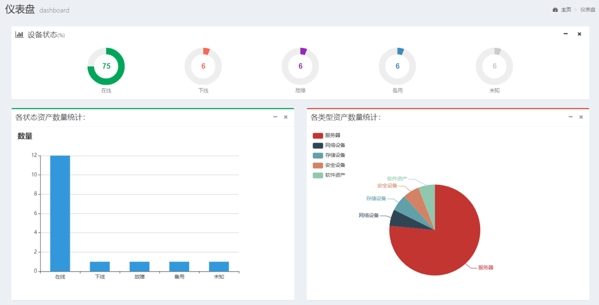

# 12.dashboard仪表盘

对于运维管理平台，一个总览的dashboard仪表盘界面是必须有的，不但提升整体格调，也有利于向老板‘邀功请赏’。

dashboard页面必须酷炫吊炸天，所以界面元素应当美观、丰富、富有冲击力。

完整的dashboard.html文件代码如下：

```


仪表盘



    <!-- Content Header (Page header) -->
    <section class="content-header">
      <h1>
        仪表盘
        <small>dashboard</small>
      </h1>
      <ol class="breadcrumb">
        <li><a href="#"><i class="fa fa-dashboard"></i> 主页</a></li>
        <li class="active">仪表盘</li>
      </ol>
    </section>




      <!-- Main content -->
    <section class="content">
    <div class="row">
        <!-- row -->
        <div class="col-md-12">
          <!-- jQuery Knob -->
          <div class="box box-solid">
            <div class="box-header">
              <i class="fa fa-bar-chart-o"></i>

              <h3 class="box-title">设备状态<small>(%)</small></h3>

              <div class="box-tools pull-right">
                <button type="button" class="btn btn-default btn-sm" data-widget="collapse"><i class="fa fa-minus"></i>
                </button>
                <button type="button" class="btn btn-default btn-sm" data-widget="remove"><i class="fa fa-times"></i>
                </button>
              </div>
            </div>
            <!-- /.box-header -->
            <div class="box-body">
              <div class="row">
                <div class="col-xs-6 col-md-2 col-md-offset-1 text-center">
                  <input type="text" class="knob" value="{{ up_rate }}" data-width="90" data-height="90" data-fgColor="#00a65a" data-readonly="true">

                  <div class="knob-label">在线</div>
                </div>
                <!-- ./col -->
                <div class="col-xs-6 col-md-2 text-center">
                  <input type="text" class="knob" value="{{ o_rate }}" data-width="90" data-height="90" data-fgColor="#f56954" data-readonly="true">

                  <div class="knob-label">下线</div>
                </div>
                <!-- ./col -->


                <div class="col-xs-6 col-md-2 text-center">
                  <input type="text" class="knob" value="{{ bd_rate }}" data-width="90" data-height="90" data-fgColor="#932ab6" data-readonly="true">

                  <div class="knob-label">故障</div>
                </div>
                <!-- ./col -->
                <div class="col-xs-6 col-md-2 text-center">
                  <input type="text" class="knob" value="{{ bu_rate }}" data-width="90" data-height="90" data-fgColor="#3c8dbc" data-readonly="true">

                  <div class="knob-label">备用</div>
                </div>
                  <!-- ./col -->
                <div class="col-xs-6 col-md-2 text-center">
                  <input type="text" class="knob" value="{{ un_rate }}" data-width="90" data-height="90" data-fgColor="#cccccc" data-readonly="true">

                  <div class="knob-label">未知</div>
                </div>
                <!-- ./col -->
              </div>
              <!-- /.row -->
            </div>
            <!-- /.box-body -->
          </div>
          <!-- /.box -->
        </div>
        <!-- /.col -->


        <div class="col-md-6">
            <!-- BAR CHART -->
          <div class="box box-success">

            <div class="box-header with-border">
              <h3 class="box-title">各状态资产数量统计：</h3>

              <div class="box-tools pull-right">
                <button type="button" class="btn btn-box-tool" data-widget="collapse"><i class="fa fa-minus"></i>
                </button>
                <button type="button" class="btn btn-box-tool" data-widget="remove"><i class="fa fa-times"></i></button>
              </div>
            </div>
            <div class="box-body">
                {# 百度Echarts实现柱状图#}
                <div id="barChart" style="width: 600px;height:400px;"></div>
            </div>
            <!-- /.box-body -->
          </div>
        </div>


        <div class="col-md-6">
          <!-- DONUT CHART -->
          <div class="box box-danger">
            <div class="box-header with-border">
              <h3 class="box-title">各类型资产数量统计：</h3>

              <div class="box-tools pull-right">
                <button type="button" class="btn btn-box-tool" data-widget="collapse"><i class="fa fa-minus"></i>
                </button>
                <button type="button" class="btn btn-box-tool" data-widget="remove"><i class="fa fa-times"></i></button>
              </div>
            </div>
            <div class="box-body">
                {# 百度Echarts实现饼状图#}
              <div id="donutChart" style="width: 600px;height:400px;"></div>
            </div>
            <!-- /.box-body -->
          </div>
          <!-- /.box -->
        </div>
        <!-- /.col (RIGHT) -->
      </div>
      <!-- /.row -->

    </section>
    <!-- /.content -->





    <script src="https://cdn.bootcss.com/echarts/4.2.1/echarts.min.js"></script>
    <!-- AdminLTE App -->
    <script src=""></script>
    <!-- page script -->

    <script type="text/javascript">

    // 顶部服务器状态百分率圆图
    $(function () {
        /* jQueryKnob */

        $(".knob").knob({
             /*change : function (value) {
       //console.log("change : " + value);
       },
       release : function (value) {
       console.log("release : " + value);
       },
       cancel : function () {
       console.log("cancel : " + this.value);
       },*/
      draw: function () {
             // "tron" case
        if (this.$.data('skin') == 'tron'
                ) {

          var a = this.angle(this.

                    cv)  // Angle
              , sa = this.
                            startAngle          // Previous start angle
              , sat = this.startAngle         // Start angle
              , ea                            // Previous end angle
              , eat = sat + a                 // End angle
              , r = true;

          this.g.lineWidth = this.lineWidth;

          this.o.cursor
          && (sat = eat - 0.3)
          && (eat = eat + 0.3);

          if (this.o.displayPrevious) {
            ea = this.startAngle + this.angle(this.value);
            this.o.cursor
            && (sa = ea - 0.3)
            && (ea = ea + 0.3);
            this.g.beginPath();
            this.g.strokeStyle = this.previousColor;
            this.g.arc(this.xy, this.xy, this.radius - this.lineWidth, sa, ea, false);
            this.g.stroke();
          }

          this.g.beginPath();
          this.g.strokeStyle = r ? this.o.fgColor : this.fgColor;
          this.g.arc(this.xy, this.xy, this.radius - this.lineWidth, sat, eat, false);
          this.g.stroke();

          this.g.lineWidth = 2;
          this.g.beginPath();
          this.g.strokeStyle = this.o.fgColor;
          this.g.arc(this.xy, this.xy, this.radius - this.lineWidth + 1 + this.lineWidth * 2 / 3, 0, 2 * Math.PI, false);
          this.g.stroke();

          return false;
        }
      }
    });
    /* END JQUERY KNOB */
    });

    //不同状态资产数量统计 柱状图
    $(function () {
        // 基于准备好的dom，初始化echarts实例
        var myChart = echarts.init(document.getElementById('barChart'));

        // 指定图表的配置项和数据
        var option = {
            color: ['#3398DB'],
            title: {
                text: '数量'
            },
            tooltip: {},
            legend: { data:['']
            },
            xAxis: {
                data: ["在线", "下线","故障","备用","未知"] },
            yAxis: {
            },
            series:
                [{
                name: '数量',
                type: 'bar',
                barWidth: '50%',
                data: [{{ upline }}, {{ offline }}, {{ breakdown }}, {{ backup }}, {{ unknown }}]
            }]
        };
            // 使用刚指定的配置项和数据显示图表。
            myChart.setOption(option);
    });

    //资产类型数量统计 饼图
    $(function () {
        // 基于准备好的dom，初始化echarts实例
        var myChart = echarts.init(document.getElementById('donutChart'));

        // 指定图表的配置项和数据
        option = {
            title : {
                x:'center'
            },
            tooltip : {
                trigger: 'item',
                formatter: "{a} <br/>{b} : {c} ({d}%)"
            },
            legend: {
                orient: 'vertical',
                left: 'left',
                data: ['服务器','网络设备','存储设备','安全设备','软件资产']
            },
            series : [
                {
                    name: '资产类型',
                    type: 'pie',
                    radius : '55%',
                    center: ['50%', '60%'],
                    data:[
                        {value:{{ server_number }}, name:'服务器'},
                        {value:{{ networkdevice_number }}, name:'网络设备'},
                        {value:{{ storagedevice_number }}, name:'存储设备'},
                        {value:{{ securitydevice_number }}, name:'安全设备'},
                        {value:{{ software_number }}, name:'软件资产'}
                    ],
                    itemStyle: {
                        emphasis: {
                            shadowBlur: 10,
                            shadowOffsetX: 0,
                            shadowColor: 'rgba(0, 0, 0, 0.5)'
                        }
                    }
                }
            ]
        };
            // 使用刚指定的配置项和数据显示图表。
            myChart.setOption(option);
    });

    </script>


```

## 一、资产状态占比图

首先，制作一个资产状态百分比表盘，用于显示上线、下线、未知、故障和备用五种资产在总资产中的占比。**注意是占比，不是数量！**

按照AdminLTE中提供的示例，在HTML中添加相应的标签，在script中添加相应的JS代码（jQueryKnob）。JS代码基本照抄，不需要改动。对于显示的圆圈，可以修改其颜色、大小、形态、是否只读等属性，可以参照AdminLTE中的范例。

最重要的是，需要从数据库中获取相应的数据，修改`assets/views.py`中的dashboard视图，最终如下：

```
def dashboard(request):
    total = models.Asset.objects.count()
    upline = models.Asset.objects.filter(status=0).count()
    offline = models.Asset.objects.filter(status=1).count()
    unknown = models.Asset.objects.filter(status=2).count()
    breakdown = models.Asset.objects.filter(status=3).count()
    backup = models.Asset.objects.filter(status=4).count()
    up_rate = round(upline/total*100)
    o_rate = round(offline/total*100)
    un_rate = round(unknown/total*100)
    bd_rate = round(breakdown/total*100)
    bu_rate = round(backup/total*100)
    server_number = models.Server.objects.count()
    networkdevice_number = models.NetworkDevice.objects.count()
    storagedevice_number = models.StorageDevice.objects.count()
    securitydevice_number = models.SecurityDevice.objects.count()
    software_number = models.Software.objects.count()

    return render(request, 'assets/dashboard.html', locals())
```

代码很简单，分别获取资产总数量，上线、下线、未知、故障和备用资产的数量，然后计算出各自的占比，例如上线率`up_rate`。同时获取服务器、网络设备、安全设备和软件设备的数量，后面需要使用。

在dashboard.html中修改各input框的value属性为`value="{{ up_rate }}"`（以上线率为例），这是最关键的步骤，前端会根据这个值的大小，决定圆圈的幅度。

完成后的页面如下图所示：


## 二、不同状态资产数量统计柱状图

要绘制柱状图，不可能我们自己一步步从无到有写起，建议使用第三方插件。AdminLTE中内置的是Chartjs插件，但更建议大家使用百度开源的Echarts插件，功能更强大，更容易学习。

百度Echarts的网址是：http://echarts.baidu.com/，提供插件下载、说明文档和在线帮助。

这里，我们使用CDN的方式，直接引用Echarts：

```
<script src="https://cdn.bootcss.com/echarts/4.2.1/echarts.min.js"></script>
```

使用Echarts的柱状图很简单，首先生成一个用于放置图形的容器：

```
<div class="col-md-6">
    <!-- BAR CHART -->
  <div class="box box-success">

    <div class="box-header with-border">
      <h3 class="box-title">各状态资产数量统计：</h3>

      <div class="box-tools pull-right">
        <button type="button" class="btn btn-box-tool" data-widget="collapse"><i class="fa fa-minus"></i>
        </button>
        <button type="button" class="btn btn-box-tool" data-widget="remove"><i class="fa fa-times"></i></button>
      </div>
    </div>
    <div class="box-body">
        <div id="barChart" style="width: 600px;height:400px;"></div>
    </div>
    <!-- /.box-body -->
  </div>
</div>
```

上面的核心是`<div id="barChart" style="width: 600px;height:400px;"></div>`这句，它指明了图表的id和容器大小。其它的都是AdminLTE框架需要的元素，用于生成表头和折叠、关闭动作按钮。我们的容器是可以折叠和删除的，也是移动端自适应的。

构造了容器后，在`<script></script>`中，添加初始化的js代码：

```
$(function () {
        // 基于准备好的dom，初始化echarts实例
        var myChart = echarts.init(document.getElementById('barChart'));

        // 指定图表的配置项和数据
        var option = {
            color: ['#3398DB'],
            title: {
                text: '数量'
            },
            tooltip: {},
            legend: { data:['']
            },
            xAxis: {
                data: ["在线", "下线","故障","备用","未知"] },
            yAxis: {},
            series:
                [{
                name: '数量',
                type: 'bar',
                barWidth: '50%',
                data: [{{ upline }}, {{ offline }}, {{ breakdown }}, {{ backup }}, {{ unknown }}]
            }]
        };
            // 使用刚指定的配置项和数据显示图表。
            myChart.setOption(option);
    });
```

上面的js代码中，中文文字部分很容易理解，就是x轴的说明文字。还可以设置柱状图的颜色、宽度等特性。关键是series列表，其中的type指定该图表是什么类型，bar表示柱状图，而data就是至关重要的具体数据了，利用模板语言，将从数据库中获取的具体数值传入进来，Echarts插件会根据数值进行动态调整。


## 三、各类型资产数量统计饼图

类似上面的柱状图，在HTML中需要先添加一个容器。不同之处在于初始化的JS代码：

```
//资产类型数量统计 饼图
    $(function () {
        // 基于准备好的dom，初始化echarts实例
        var myChart = echarts.init(document.getElementById('donutChart'));

        // 指定图表的配置项和数据
        option = {
            title : {
                x:'center'
            },
            tooltip : {
                trigger: 'item',
                formatter: "{a} <br/>{b} : {c} ({d}%)"
            },
            legend: {
                orient: 'vertical',
                left: 'left',
                data: ['服务器','网络设备','存储设备','安全设备','软件资产']
            },
            series : [
                {
                    name: '资产类型',
                    type: 'pie',
                    radius : '55%',
                    center: ['50%', '60%'],
                    data:[
                        {value:{{ server_number }}, name:'服务器'},
                        {value:{{ networkdevice_number }}, name:'网络设备'},
                        {value:{{ storagedevice_number }}, name:'存储设备'},
                        {value:{{ securitydevice_number }}, name:'安全设备'},
                        {value:{{ software_number }}, name:'软件资产'}
                    ],
                    itemStyle: {
                        emphasis: {
                            shadowBlur: 10,
                            shadowOffsetX: 0,
                            shadowColor: 'rgba(0, 0, 0, 0.5)'
                        }
                    }
                }
            ]
        };
            // 使用刚指定的配置项和数据显示图表。
            myChart.setOption(option);
    });
```

series中的type指定为pie，表示饼图，data列表动态传入各种资产类型的数量。其它的设置可参考官方文档。

为了展示的方便，我们在admin中新建一些网络设备、安全设备、软件资产等其它类型的资产，然后查看资产总表和饼图。


查看dashboard如下图所示：



## 四、项目总结

至此，CMDB项目就基本讲解完毕。

还是要强调的是，这是一个教学版，很多内容和细节没有实现，必然存在bug和不足。但不管怎么样，它至少包含CMDB资产管理的主体内容，如果你能从中有点收获，那么教程的目的就达到了。