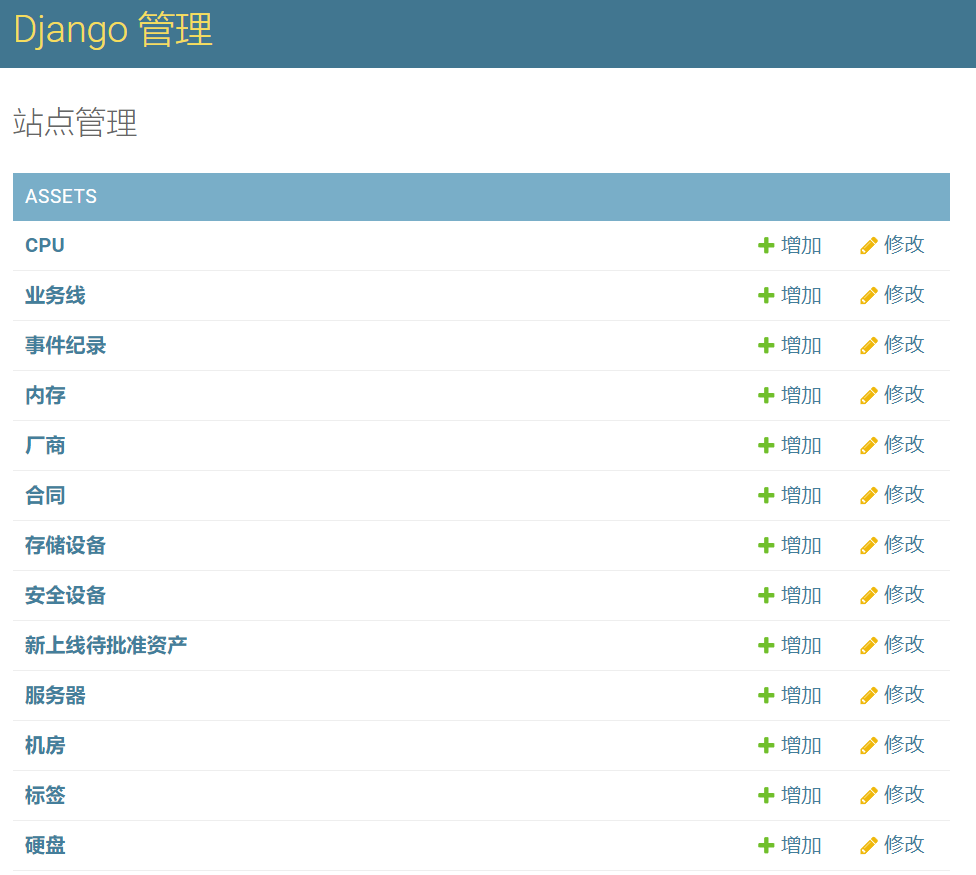
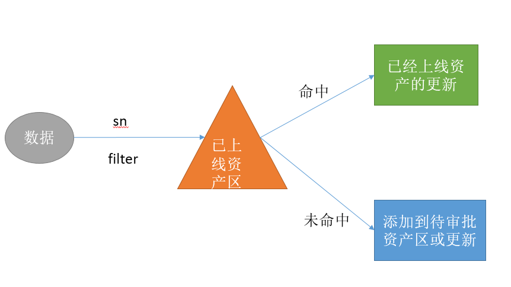
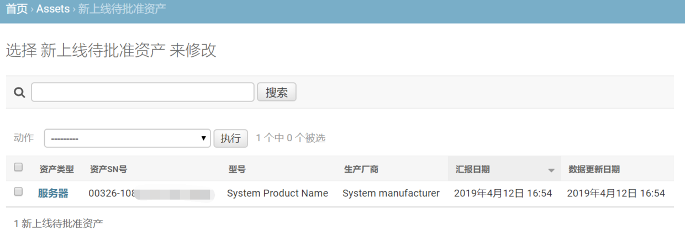
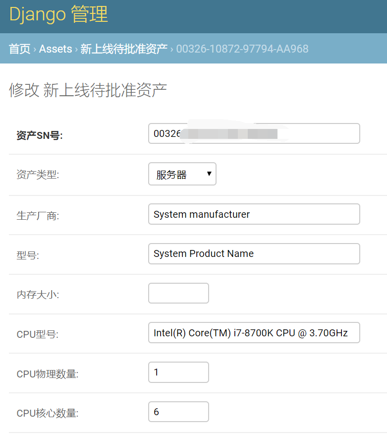
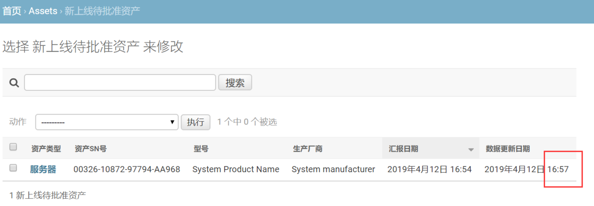

# 6.新资产待审批区

## 一、启用admin

前面，我们已经完成了数据收集客户端的编写和测试，下面我们就可以在admin中展示和管理资产数据了。

首先，通过`python manage.py createsuperuser`创建一个管理员账户。

然后，进入`/assets/admin.py`文件，写入下面的代码：

```
from django.contrib import admin
# Register your models here.
from assets import models


class NewAssetAdmin(admin.ModelAdmin):
    list_display = ['asset_type', 'sn', 'model', 'manufacturer', 'c_time', 'm_time']
    list_filter = ['asset_type', 'manufacturer', 'c_time']
    search_fields = ('sn',)


class AssetAdmin(admin.ModelAdmin):
    list_display = ['asset_type', 'name', 'status', 'approved_by', 'c_time', "m_time"]


admin.site.register(models.Asset, AssetAdmin)
admin.site.register(models.Server)
admin.site.register(models.StorageDevice)
admin.site.register(models.SecurityDevice)
admin.site.register(models.BusinessUnit)
admin.site.register(models.Contract)
admin.site.register(models.CPU)
admin.site.register(models.Disk)
admin.site.register(models.EventLog)
admin.site.register(models.IDC)
admin.site.register(models.Manufacturer)
admin.site.register(models.NetworkDevice)
admin.site.register(models.NIC)
admin.site.register(models.RAM)
admin.site.register(models.Software)
admin.site.register(models.Tag)
admin.site.register(models.NewAssetApprovalZone, NewAssetAdmin)
```

利用刚才创建的管理员用户，登录admin站点：



这里略微对admin界面做了些简单地配置，但目前还没有数据。

## 二、创建新资产

前面我们只是在Pycharm中获取并打印数据，并没有将数据保存到数据库里。下面我们来实现这一功能。

修改/assets/views.py文件，代码如下：

```
from django.shortcuts import render
from django.shortcuts import HttpResponse
from django.views.decorators.csrf import csrf_exempt
import json
from assets import models
from assets import asset_handler
# Create your views here.

@csrf_exempt
def report(request):
    """
    通过csrf_exempt装饰器，跳过Django的csrf安全机制，让post的数据能被接收，但这又会带来新的安全问题。
    可以在客户端，使用自定义的认证token，进行身份验证。这部分工作，请根据实际情况，自己进行。
    :param request:
    :return:
    """
    if request.method == "POST":
        asset_data = request.POST.get('asset_data')
        data = json.loads(asset_data)
        # 各种数据检查，请自行添加和完善！
        if not data:
            return HttpResponse("没有数据！")
        if not issubclass(dict, type(data)):
            return HttpResponse("数据必须为字典格式！")
        # 是否携带了关键的sn号
        sn = data.get('sn', None)
        if sn:
            # 进入审批流程
            # 首先判断是否在上线资产中存在该sn
            asset_obj = models.Asset.objects.filter(sn=sn)
            if asset_obj:
                # 进入已上线资产的数据更新流程
                pass
                return HttpResponse("资产数据已经更新！")
            else:   # 如果已上线资产中没有，那么说明是未批准资产，进入新资产待审批区，更新或者创建资产。
                obj = asset_handler.NewAsset(request, data)
                response = obj.add_to_new_assets_zone()
                return HttpResponse(response)
        else:
            return HttpResponse("没有资产sn序列号，请检查数据！")
    return HttpResponse('200 ok')
```

report视图的逻辑是这样的：

- **sn是标识一个资产的唯一字段，必须携带，不能重复！**
- 从POST中获取发送过来的数据；
- 使用json转换数据类型；
- 进行各种数据检查（比如身份验证等等，请自行完善）；
- 判断数据是否为空，空则返回错误信息，结束视图；
- 判断data的类型是否字典类型，否则返回错误信息；
- 之所以要对data的类型进行判断是因为后面要大量的使用字典的get方法和中括号操作；
- 如果没有携带sn号，返回错误信息；

当前面都没问题时，进入下面的流程：

- 首先，利用sn值尝试在已上线的资产进行查找，如果有，则进入已上线资产的更新流程，具体实现，这里暂且跳过;
- 如果没有，说明这是个新资产，需要添加到新资产区；
- 这里又分两种情况，一种是彻底的新资产，那没得说，需要新增；另一种是新资产区已经有了，但是审批员还没来得及审批，资产数据的后续报告就已经到达了，那么需要更新数据。
- 创建一个`asset_handler.NewAsset()`对象，然后调用它的`obj.add_to_new_assets_zone()`方法，进行数据保存，并接收返回结果；
- asset_handler是下面我们要新建的资产处理模块，NewAsset是其中的一个类。
- 

为了不让`views.py`文件过于庞大，通常会建立新的py文件，专门处理一些核心业务。

在assets下新建`asset_handler.py`文件，并写入下面的代码：

```
import json
from assets import models


class NewAsset(object):
    def __init__(self, request, data):
        self.request = request
        self.data = data

    def add_to_new_assets_zone(self):
        defaults = {
            'data': json.dumps(self.data),
            'asset_type': self.data.get('asset_type'),
            'manufacturer': self.data.get('manufacturer'),
            'model': self.data.get('model'),
            'ram_size': self.data.get('ram_size'),
            'cpu_model': self.data.get('cpu_model'),
            'cpu_count': self.data.get('cpu_count'),
            'cpu_core_count': self.data.get('cpu_core_count'),
            'os_distribution': self.data.get('os_distribution'),
            'os_release': self.data.get('os_release'),
            'os_type': self.data.get('os_type'),

        }
        models.NewAssetApprovalZone.objects.update_or_create(sn=self.data['sn'], defaults=defaults)

        return '资产已经加入或更新待审批区！'
```

NewAsset类接收两个参数，request和data，分别封装了请求和资产数据，它的唯一方法`obj.add_to_new_assets_zone()`中，首先构造了一个defaults字典，分别将资产数据包的各种数据打包进去，然后利用Django中特别好用的`update_or_create()`方法，进行数据保存！

`update_or_create()`方法的机制：如果数据库内没有该数据，那么新增，如果有，则更新，这就大大减少了我们的代码量，不用写两个方法。该方法的参数必须为一些用于查询的指定字段（这里是sn），以及需要新增或者更新的defaults字典。而其返回值，则是一个查询对象和是否新建对象布尔值的二元元组。

## 三、测试数据

重启CMDB，在Client中使用`python main.py report_data`，发送一个资产数据给CMDB服务器，结果如下：

```
(venv) D:\work\2019\for_test\CMDB\Client\bin>python main.py report_data
正在将数据发送至： [http://192.168.0.100:8000/assets/report/]  ......
?[31;1m发送完毕！?[0m
返回结果：资产已经加入或更新待审批区！
日志记录成功！
```

再进入admin后台，查看新资产待审批区，可以看到资产已经成功进入待审批区：






这里我们显示了资产的汇报和更新日期，过几分钟后，重新汇报该资产数据，然后刷新admin中的页面，可以看到，待审批区的资产数据也一并被更新了。

