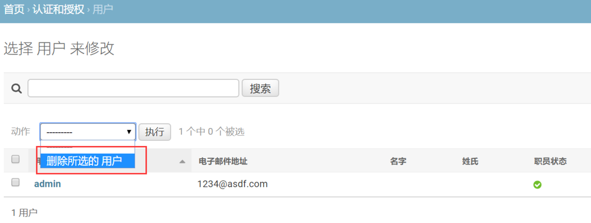
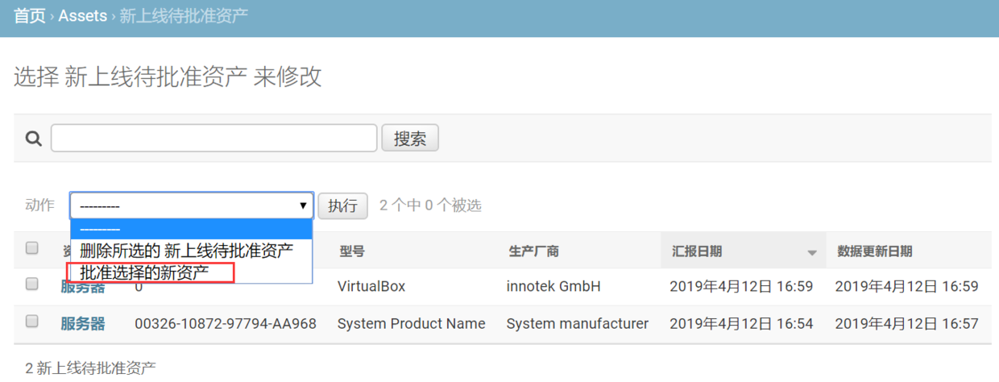
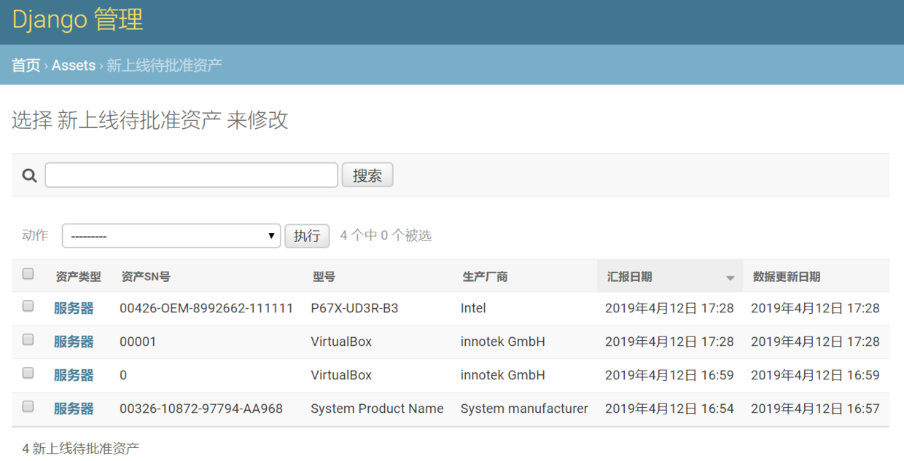
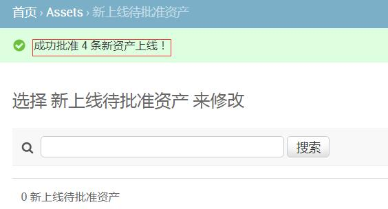
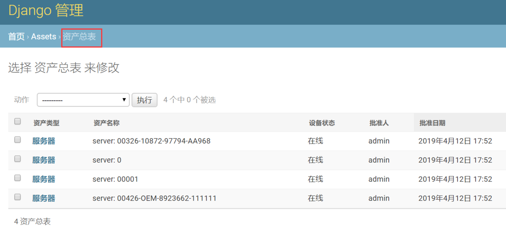
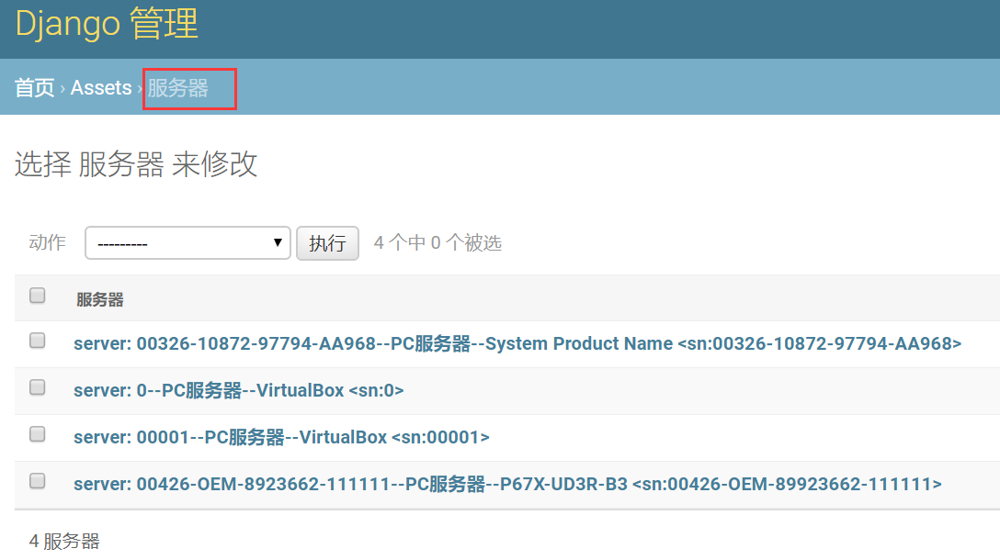
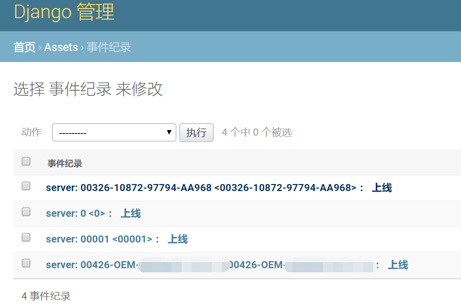

# 7.审批新资产

## 一、自定义admin的actions

需要有专门的审批员来审批新资产，对资产的合法性、健全性、可用性等更多方面进行审核，如果没有问题，那么就批准上线。

批准上线这一操作是通过admin的自定义actions来实现的。

Django的admin默认有一个delete操作的action，所有在admin中的模型都有这个action，更多的就需要我们自己编写了。

修改`/assets/admin.py`的代码，新的代码如下：

```
from django.contrib import admin
# Register your models here.
from assets import models
from assets import asset_handler


class NewAssetAdmin(admin.ModelAdmin):
    list_display = ['asset_type', 'sn', 'model', 'manufacturer', 'c_time', 'm_time']
    list_filter = ['asset_type', 'manufacturer', 'c_time']
    search_fields = ('sn',)

    actions = ['approve_selected_new_assets']

    def approve_selected_new_assets(self, request, queryset):
        # 获得被打钩的checkbox对应的资产
        selected = request.POST.getlist(admin.ACTION_CHECKBOX_NAME)
        success_upline_number = 0
        for asset_id in selected:
            obj = asset_handler.ApproveAsset(request, asset_id)
            ret = obj.asset_upline()
            if ret:
                success_upline_number += 1
        # 顶部绿色提示信息
        self.message_user(request, "成功批准  %s  条新资产上线！" % success_upline_number)
    approve_selected_new_assets.short_description = "批准选择的新资产"

class AssetAdmin(admin.ModelAdmin):
    list_display = ['asset_type', 'name', 'status', 'approved_by', 'c_time', "m_time"]


admin.site.register(models.Asset, AssetAdmin)
admin.site.register(models.Server)
admin.site.register(models.StorageDevice)
admin.site.register(models.SecurityDevice)
admin.site.register(models.BusinessUnit)
admin.site.register(models.Contract)
admin.site.register(models.CPU)
admin.site.register(models.Disk)
admin.site.register(models.EventLog)
admin.site.register(models.IDC)
admin.site.register(models.Manufacturer)
admin.site.register(models.NetworkDevice)
admin.site.register(models.NIC)
admin.site.register(models.RAM)
admin.site.register(models.Software)
admin.site.register(models.Tag)
admin.site.register(models.NewAssetApprovalZone, NewAssetAdmin)
```

说明：

- 通过`actions = ['approve_selected_new_assets']`定义当前模型的新acitons列表；
- `approve_selected_new_assets()`方法包含具体的动作逻辑；
- 自定义的action接收至少三个参数，第一个是self，第二个是request即请求，第三个是被选中的数据对象集合queryset。
- 首先通过`request.POST.getlist()`方法获取被打钩的checkbox对应的资产；
- 可能同时有多个资产被选择，所以这是个批量操作，需要进行循环；
- selected是一个包含了被选中资产的id值的列表；
- 对于每一个资产，创建一个`asset_handler.ApproveAsset()`的实例，然后调用实例的`asset_upline()`方法，并获取返回值。如果返回值为True，说明该资产被成功批准，那么`success_upline_number`变量+1，保存成功批准的资产数；
- 最后，在admin中给与提示信息。
- `approve_selected_new_assets.short_description = "批准选择的新资产"`用于在admin界面中为action提供中文显示。你可以尝试去掉这条，看看效果。

重新启动CMDB，进入admin的待审批资产区，查看上方的acitons动作条，如下所示：



## 二、创建测试用例

由于没有真实的服务器供测试，这里需要手动创建一些虚假的服务器用例，方便后面的使用和展示。

首先，将先前的所有资产条目全部从admin中删除，确保数据库内没有任何数据。

然后，在Client/bin/目录下新建一个`report_assets`脚本，其内容如下：

```
# -*- coding:utf-8 -*-
import json

import urllib.request
import urllib.parse

import os
import sys

BASE_DIR = os.path.dirname(os.getcwd())
# 设置工作目录，使得包和模块能够正常导入
sys.path.append(BASE_DIR)
from conf import settings


def update_test(data):
    """
    创建测试用例
    :return:
    """
    # 将数据打包到一个字典内，并转换为json格式
    data = {"asset_data": json.dumps(data)}
    # 根据settings中的配置，构造url
    url = "http://%s:%s%s" % (settings.Params['server'], settings.Params['port'], settings.Params['url'])
    print('正在将数据发送至： [%s]  ......' % url)
    try:
        # 使用Python内置的urllib.request库，发送post请求。
        # 需要先将数据进行封装，并转换成bytes类型
        data_encode = urllib.parse.urlencode(data).encode()
        response = urllib.request.urlopen(url=url, data=data_encode, timeout=settings.Params['request_timeout'])
        print("\033[31;1m发送完毕！\033[0m ")
        message = response.read().decode()
        print("返回结果：%s" % message)
    except Exception as e:
        message = "发送失败"
        print("\033[31;1m发送失败，%s\033[0m" % e)


if __name__ == '__main__':
    windows_data = {
        "os_type": "Windows",
        "os_release": "7 64bit  6.1.7601 ",
        "os_distribution": "Microsoft",
        "asset_type": "server",
        "cpu_count": 2,
        "cpu_model": "Intel(R) Core(TM) i5-2300 CPU @ 2.80GHz",
        "cpu_core_count": 8,
        "ram": [
            {
                "slot": "A1",
                "capacity": 8,
                "model": "Physical Memory",
                "manufacturer": "kingstone ",
                "sn": "456"
            },

        ],
        "manufacturer": "Intel",
        "model": "P67X-UD3R-B3",
        "wake_up_type": 6,
        "sn": "00426-OEM-8992662-111111",
        "physical_disk_driver": [
            {
                "iface_type": "unknown",
                "slot": 0,
                "sn": "3830414130423230343234362020202020202020",
                "model": "KINGSTON SV100S264G ATA Device",
                "manufacturer": "(标准磁盘驱动器)",
                "capacity": 128
            },
            {
                "iface_type": "SATA",
                "slot": 1,
                "sn": "383041413042323023234362020102020202020",
                "model": "KINGSTON SV100S264G ATA Device",
                "manufacturer": "(标准磁盘驱动器)",
                "capacity": 2048
            },

        ],
        "nic": [
            {
                "mac": "14:CF:22:FF:48:34",
                "model": "[00000011] Realtek RTL8192CU Wireless LAN 802.11n USB 2.0 Network Adapter",
                "name": 11,
                "ip_address": "192.168.1.110",
                "net_mask": [
                    "255.255.255.0",
                    "64"
                ]
            },
            {
                "mac": "0A:01:27:00:00:00",
                "model": "[00000013] VirtualBox Host-Only Ethernet Adapter",
                "name": 13,
                "ip_address": "192.168.56.1",
                "net_mask": [
                    "255.255.255.0",
                    "64"
                ]
            },
            {
                "mac": "14:CF:22:FF:48:34",
                "model": "[00000017] Microsoft Virtual WiFi Miniport Adapter",
                "name": 17,
                "ip_address": "",
                "net_mask": ""
            },
            {
                "mac": "14:CF:22:FF:48:34",
                "model": "Intel Adapter",
                "name": 17,
                "ip_address": "192.1.1.1",
                "net_mask": ""
            },


        ]
    }


    linux_data = {
        "asset_type": "server",
        "manufacturer": "innotek GmbH",
        "sn": "00001",
        "model": "VirtualBox",
        "uuid": "E8DE611C-4279-495C-9B58-502B6FCED076",
        "wake_up_type": "Power Switch",
        "os_distribution": "Ubuntu",
        "os_release": "Ubuntu 16.04.3 LTS",
        "os_type": "Linux",
        "cpu_count": "2",
        "cpu_core_count": "4",
        "cpu_model": "Intel(R) Core(TM) i5-2300 CPU @ 2.80GHz",
        "ram": [
            {
                "slot": "A1",
                "capacity": 8,
            }
        ],
        "ram_size": 3.858997344970703,
        "nic": [],
        "physical_disk_driver": [
            {
                "model": "VBOX HARDDISK",
                "size": "50",
                "sn": "VBeee1ba73-09085302"
            }
        ]
    }

    update_test(linux_data)
    update_test(windows_data)
```

该脚本的作用很简单，人为虚构了两台服务器（一台windows，一台Linux）的信息，并发送给CMDB。单独执行该脚本，在admin的新资产待审批区可以看到添加了两条新资产信息。

要添加更多的资产，只需修改脚本中`windows_data`和`linux_data`的数据即可。但是要注意的是，如果不修改sn，那么会变成资产数据更新，而不是增加新资产，这一点一定要注意。

OK，我们再加两条资产，这样就变成四个实例了。



## 三、批准资产上线

有已经忍不住点击‘执行’命令的请举手！

是不是出现了错误？

```
AttributeError at /admin/assets/newassetapprovalzone/
module 'assets.asset_handler' has no attribute 'ApproveAsset'
```

这是必然的，因为还没有写如何上线的代码啊！

在`/assets/asset_handler.py`中添加下面的代码：

```
def log(log_type, msg=None, asset=None, new_asset=None, request=None):
    """
    记录日志
    """
    event = models.EventLog()
    if log_type == "upline":
        event.name = "%s <%s> ：  上线" % (asset.name, asset.sn)
        event.asset = asset
        event.detail = "资产成功上线！"
        event.user = request.user
    elif log_type == "approve_failed":
        event.name = "%s <%s> ：  审批失败" % (new_asset.asset_type, new_asset.sn)
        event.new_asset = new_asset
        event.detail = "审批失败！\n%s" % msg
        event.user = request.user
    # 更多日志类型.....
    event.save()


class ApproveAsset:
    """
    审批资产并上线。
    """
    def __init__(self, request, asset_id):
        self.request = request
        self.new_asset = models.NewAssetApprovalZone.objects.get(id=asset_id)
        self.data = json.loads(self.new_asset.data)

    def asset_upline(self):
        # 为以后的其它类型资产扩展留下接口
        func = getattr(self, "_%s_upline" % self.new_asset.asset_type)
        ret = func()
        return ret

    def _server_upline(self):
        # 在实际的生产环境中，下面的操作应该是原子性的整体事务，任何一步出现异常，所有操作都要回滚。
        asset = self._create_asset()  # 创建一条资产并返回资产对象。注意要和待审批区的资产区分开。
        try:
            self._create_manufacturer(asset) # 创建厂商
            self._create_server(asset)       # 创建服务器
            self._create_CPU(asset)          # 创建CPU
            self._create_RAM(asset)          # 创建内存
            self._create_disk(asset)         # 创建硬盘
            self._create_nic(asset)          # 创建网卡
            self._delete_original_asset()    # 从待审批资产区删除已审批上线的资产
        except Exception as e:
            asset.delete()
            log('approve_failed', msg=e, new_asset=self.new_asset, request=self.request)
            print(e)
            return False
        else:
            # 添加日志
            log("upline", asset=asset, request=self.request)
            print("新服务器上线!")
            return True

    def _create_asset(self):
        """
        创建资产并上线
        :return:
        """
        # 利用request.user自动获取当前管理人员的信息，作为审批人添加到资产数据中。
        asset = models.Asset.objects.create(asset_type=self.new_asset.asset_type,
                                            name="%s: %s" % (self.new_asset.asset_type, self.new_asset.sn),
                                            sn=self.new_asset.sn,
                                            approved_by=self.request.user,
                                            )
        return asset

    def _create_manufacturer(self, asset):
        """
        创建厂商
        :param asset:
        :return:
        """
        # 判断厂商数据是否存在。如果存在，看看数据库里是否已经有该厂商，再决定是获取还是创建。
        m = self.new_asset.manufacturer
        if m:
            manufacturer_obj, _ = models.Manufacturer.objects.get_or_create(name=m)
            asset.manufacturer = manufacturer_obj
            asset.save()

    def _create_server(self, asset):
        """
        创建服务器
        :param asset:
        :return:
        """
        models.Server.objects.create(asset=asset,
                                     model=self.new_asset.model,
                                     os_type=self.new_asset.os_type,
                                     os_distribution=self.new_asset.os_distribution,
                                     os_release=self.new_asset.os_release,
                                     )

    def _create_CPU(self, asset):
        """
        创建CPU.
        教程这里对发送过来的数据采取了最大限度的容忍，
        实际情况下你可能还要对数据的完整性、合法性、数据类型进行检测，
        根据不同的检测情况，是被动接收，还是打回去要求重新收集，请自行决定。
        这里的业务逻辑非常复杂，不可能面面俱到。
        :param asset:
        :return:
        """
        cpu = models.CPU.objects.create(asset=asset)
        cpu.cpu_model = self.new_asset.cpu_model
        cpu.cpu_count = self.new_asset.cpu_count
        cpu.cpu_core_count = self.new_asset.cpu_core_count
        cpu.save()

    def _create_RAM(self, asset):
        """
        创建内存。通常有多条内存
        :param asset:
        :return:
        """
        ram_list = self.data.get('ram')
        if not ram_list:    # 万一一条内存数据都没有
            return
        for ram_dict in ram_list:
            if not ram_dict.get('slot'):
                raise ValueError("未知的内存插槽！")  # 使用虚拟机的时候，可能无法获取内存插槽，需要你修改此处的逻辑。
            ram = models.RAM()
            ram.asset = asset
            ram.slot = ram_dict.get('slot')
            ram.sn = ram_dict.get('sn')
            ram.model = ram_dict.get('model')
            ram.manufacturer = ram_dict.get('manufacturer')
            ram.capacity = ram_dict.get('capacity', 0)
            ram.save()

    def _create_disk(self, asset):
        """
        存储设备种类多，还有Raid情况，需要根据实际情况具体解决。
        这里只以简单的SATA硬盘为例子。可能有多块硬盘。
        :param asset:
        :return:
        """
        disk_list = self.data.get('physical_disk_driver')
        if not disk_list:  # 一条硬盘数据都没有
            return
        for disk_dict in disk_list:
            if not disk_dict.get('sn'):
                raise ValueError("未知sn的硬盘！")  # 根据sn确定具体某块硬盘。
            disk = models.Disk()
            disk.asset = asset
            disk.sn = disk_dict.get('sn')
            disk.model = disk_dict.get('model')
            disk.manufacturer = disk_dict.get('manufacturer'),
            disk.slot = disk_dict.get('slot')
            disk.capacity = disk_dict.get('capacity', 0)
            iface = disk_dict.get('interface_type')
            if iface in ['SATA', 'SAS', 'SCSI', 'SSD', 'unknown']:
                disk.interface_type = iface

            disk.save()

    def _create_nic(self, asset):
        """
        创建网卡。可能有多个网卡，甚至虚拟网卡。
        :param asset:
        :return:
        """
        nic_list = self.data.get("nic")
        if not nic_list:
            return

        for nic_dict in nic_list:
            if not nic_dict.get('mac'):
                raise ValueError("网卡缺少mac地址！")
            if not nic_dict.get('model'):
                raise ValueError("网卡型号未知！")

            nic = models.NIC()
            nic.asset = asset
            nic.name = nic_dict.get('name')
            nic.model = nic_dict.get('model')
            nic.mac = nic_dict.get('mac')
            nic.ip_address = nic_dict.get('ip_address')
            if nic_dict.get('net_mask'):
                if len(nic_dict.get('net_mask')) > 0:
                    nic.net_mask = nic_dict.get('net_mask')[0]
            nic.save()

    def _delete_original_asset(self):
        """
        这里的逻辑是已经审批上线的资产，就从待审批区删除。
        也可以设置为修改成已审批状态但不删除，只是在管理界面特别处理，不让再次审批，灰色显示。
        不过这样可能导致待审批区越来越大。
        :return:
        """
        self.new_asset.delete()
```

核心就是增加了一个记录日志的log()函数以及审批资产的ApproveAsset类。

log()函数很简单，根据日志类型的不同，保存日志需要的各种信息，比如日志名称、关联的资产对象、日志详细内容和审批人员等等。所有的日志都被保存在数据库中，可以在admin中查看。

对于关键的ApproveAsset类，说明如下：

- 初始化方法接收reqeust和待审批资产的id；
- 分别提前获取资产对象和所有数据data；
- `asset_upline()`是入口方法，通过反射，获取一个类似`_server_upline`的方法。之所以这么做，是为后面的网络设别、安全设备、存储设备等更多类型资产的审批留下扩展接口。本教程里只实现了服务器类型资产的审批方法，更多的请自行完善，过程基本类似。
- `_server_upline()`是服务器类型资产上线的核心方法：
- 它首先新建了一个Asset资产对象（注意要和待审批区的资产区分开）；
- 然后利用该对象，分别创建了对应的厂商、服务器、CPU、内存、硬盘和网卡，并删除待审批区的对应资产；
- 在实际的生产环境中，上面的操作应该是原子性的整体事务，任何一步出现异常，所有操作都要回滚；
- 如果任何一步出现错误，上面的操作全部撤销，也就是`asset.delete()`。记录错误日志，返回False；
- 如果没问题，那么记录正确日志，返回True。

对于`_create_asset(self)`方法，利用`request.user`自动获取当前管理人员的信息，作为审批人添加到资产数据中。

对于`_create_manufacturer(self, asset)`方法，先判断厂商数据是否存在，再决定是获取还是创建。

对于`_create_CPU(self, asset)`等方法，教程这里对数据采取了最大限度的容忍，实际情况下你可能还要对数据的完整性、合法性、数据类型进行检测，根据不同的检测情况，是被动接收，还是打回去要求重新收集，请自行决定。这里的业务逻辑非常复杂，不可能面面俱到。后面的内存、硬盘和网卡也是一样的。

对于`_delete_original_asset(self)`方法，这里的逻辑是已经审批上线的资产，就从待审批区删除。也可以设置为修改成已审批状态但不删除，只是在管理界面特别处理，不让再次审批，灰色显示，不过这样可能导致待审批区越来越大。

## 四、测试资产上线功能

重新启动服务器，在admin的新资产待审批区选择刚才的四条资产，然后选择上线action并点击‘执行’按钮，稍等片刻，显示`成功批准 4 条新资产上线！`的绿色提示信息，同时新资产也从待审批区被删除了，如下图所示：



然后，进入admin中的资产总表，可以看到有四条资产了。在其它相应的表内，也可以看到很多数据信息了。






往后，如果我们再次发送这四个服务器资产的信息，那就不是在待审批区了，而是已上线资产了。

最后，还可以看一下我们的日志记录：

