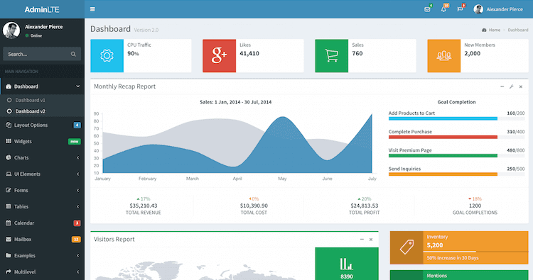
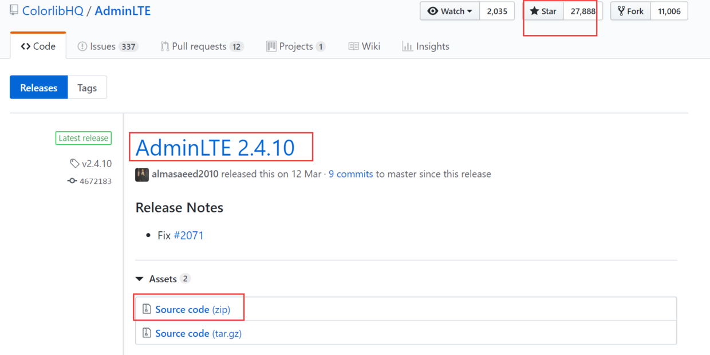

# 9.前端框架AdminLTE

作为CMDB资产管理项目，必须有一个丰富、直观、酷炫的前端页面。

适合运维平台的前端框架有很多，开源的也不少，这里选用的是AdminLTE。



AdminLTE托管在GitHub上，可以通过下面的地址下载：

https://github.com/ColorlibHQ/AdminLTE/releases



这里我们下载的是2.4.10版本，其官方文档地址：https://adminlte.io/docs/2.4/installation
AdminLTE自带JQuery和Bootstrap3框架插件，无需另外下载。

AdminLTE自带多种配色皮肤，可根据需要实时调整。

AdminLTE是移动端自适应的，无需单独考虑。

AdminLTE自带大量插件，比如表格、Charts等等，可根据需要载入。

## 一、创建base.html

AdminLTE源文件根目录下有个`starter.html`页面文件，可以利用它修改出我们CMDB项目需要的基本框架。

在项目的根目录cmdb下新建static目录，在settings文件中添加下面的配置：

```
STATICFILES_DIRS = [
    os.path.join(BASE_DIR, "static"),
]
```

为了以后扩展的方便，在`CMDB/static/`目录下再创建一级目录`adminlet-2.4.10`，将 AdminLTE源文件包里的`bower_components`、`dist`和`plugins`三个文件夹，全部拷贝到`adminlet-2.4.10`目录中，这样做的话文件会比较大，比较多，但可以防止出现引用文件找不到、插件缺失等情况的发生，等以后对AdminLTE非常熟悉了，可以对其中无用的文件进行删减。

在cmdb根目录下的templates目录中，新建`base.html`文件，将AdminLTE源文件包中的`starter.html`中的内容拷贝过去。然后，根据我们项目的具体情况修改文件引用、页面框架、title、CSS、主体和script块。这一部分工作量还是蛮大的，很繁琐，下面给出成品：

```

<!DOCTYPE html>
<!--
This is a starter template page. Use this page to start your new project from
scratch. This page gets rid of all links and provides the needed markup only.
-->
<html>
<head>
  <meta charset="utf-8">
  <meta http-equiv="X-UA-Compatible" content="IE=edge">
  <title>base</title>
  <!-- Tell the browser to be responsive to screen width -->
  <meta content="width=device-width, initial-scale=1, maximum-scale=1, user-scalable=no" name="viewport">
  <link rel="stylesheet" href="">
  <!-- Font Awesome -->
  <link rel="stylesheet" href="">
  <!-- Ionicons -->
  <link rel="stylesheet" href="">
  <!-- Theme style -->
  <link rel="stylesheet" href="">
  <!-- AdminLTE Skins. We have chosen the skin-blue for this starter
        page. However, you can choose any other skin. Make sure you
        apply the skin class to the body tag so the changes take effect. -->
  <link rel="stylesheet" href="">

    

</head>
<!--
BODY TAG OPTIONS:
=================
Apply one or more of the following classes to get the
desired effect
|---------------------------------------------------------|
| SKINS         | skin-blue                               |
|               | skin-black                              |
|               | skin-purple                             |
|               | skin-yellow                             |
|               | skin-red                                |
|               | skin-green                              |
|---------------------------------------------------------|
|LAYOUT OPTIONS | fixed                                   |
|               | layout-boxed                            |
|               | layout-top-nav                          |
|               | sidebar-collapse                        |
|               | sidebar-mini                            |
|---------------------------------------------------------|
-->
<body class="hold-transition skin-blue sidebar-mini">
<div class="wrapper">

  <!-- Main Header -->
  <header class="main-header">

    <!-- Logo -->
    <a href="#" class="logo">
      <!-- mini logo for sidebar mini 50x50 pixels -->
      <span class="logo-mini"><b>CMDB</b></span>
      <!-- logo for regular state and mobile devices -->
      <span class="logo-lg"><b>CMDB</b></span>
    </a>

    <!-- Header Navbar -->
    <nav class="navbar navbar-static-top" role="navigation">
      <!-- Sidebar toggle button-->
      <a href="#" class="sidebar-toggle" data-toggle="push-menu" role="button">
        <span class="sr-only">Toggle navigation</span>
      </a>
      <!-- Navbar Right Menu -->
      <div class="navbar-custom-menu">
        <ul class="nav navbar-nav">
          <!-- Messages: style can be found in dropdown.less-->
          <li class="dropdown messages-menu">
            <!-- Menu toggle button -->
            <a href="#" class="dropdown-toggle" data-toggle="dropdown">
              <i class="fa fa-envelope-o"></i>
              <span class="label label-success">4</span>
            </a>
            <ul class="dropdown-menu">
              <li class="header">You have 4 messages</li>
              <li>
                <!-- inner menu: contains the messages -->
                <ul class="menu">
                  <li><!-- start message -->
                    <a href="#">
                      <div class="pull-left">
                        <!-- User Image -->
                        
                      </div>
                      <!-- Message title and timestamp -->
                      <h4>
                        Support Team
                        <small><i class="fa fa-clock-o"></i> 5 mins</small>
                      </h4>
                      <!-- The message -->
                      <p>Why not buy a new awesome theme?</p>
                    </a>
                  </li>
                  <!-- end message -->
                </ul>
                <!-- /.menu -->
              </li>
              <li class="footer"><a href="#">See All Messages</a></li>
            </ul>
          </li>
          <!-- /.messages-menu -->

          <!-- Notifications Menu -->
          <li class="dropdown notifications-menu">
            <!-- Menu toggle button -->
            <a href="#" class="dropdown-toggle" data-toggle="dropdown">
              <i class="fa fa-bell-o"></i>
              <span class="label label-warning">10</span>
            </a>
            <ul class="dropdown-menu">
              <li class="header">You have 10 notifications</li>
              <li>
                <!-- Inner Menu: contains the notifications -->
                <ul class="menu">
                  <li><!-- start notification -->
                    <a href="#">
                      <i class="fa fa-users text-aqua"></i> 5 new members joined today
                    </a>
                  </li>
                  <!-- end notification -->
                </ul>
              </li>
              <li class="footer"><a href="#">View all</a></li>
            </ul>
          </li>
          <!-- Tasks Menu -->
          <li class="dropdown tasks-menu">
            <!-- Menu Toggle Button -->
            <a href="#" class="dropdown-toggle" data-toggle="dropdown">
              <i class="fa fa-flag-o"></i>
              <span class="label label-danger">9</span>
            </a>
            <ul class="dropdown-menu">
              <li class="header">You have 9 tasks</li>
              <li>
                <!-- Inner menu: contains the tasks -->
                <ul class="menu">
                  <li><!-- Task item -->
                    <a href="#">
                      <!-- Task title and progress text -->
                      <h3>
                        Design some buttons
                        <small class="pull-right">20%</small>
                      </h3>
                      <!-- The progress bar -->
                      <div class="progress xs">
                        <!-- Change the css width attribute to simulate progress -->
                        <div class="progress-bar progress-bar-aqua" style="width: 20%" role="progressbar"
                             aria-valuenow="20" aria-valuemin="0" aria-valuemax="100">
                          <span class="sr-only">20% Complete</span>
                        </div>
                      </div>
                    </a>
                  </li>
                  <!-- end task item -->
                </ul>
              </li>
              <li class="footer">
                <a href="#">View all tasks</a>
              </li>
            </ul>
          </li>
          <!-- User Account Menu -->
          <li class="dropdown user user-menu">
            <!-- Menu Toggle Button -->
            <a href="#" class="dropdown-toggle" data-toggle="dropdown">
              <!-- The user image in the navbar-->
              
              <!-- hidden-xs hides the username on small devices so only the image appears. -->
              <span class="hidden-xs">系统管理员</span>
            </a>
            <ul class="dropdown-menu">
              <!-- The user image in the menu -->
              <li class="user-header">
                

                <p>
                  系统管理员
                  <small>2019-4-12</small>
                </p>
              </li>
              <!-- Menu Body -->
              <li class="user-body">
                <div class="row">
                  <div class="col-xs-4 text-center">
                    <a href="#">Followers</a>
                  </div>
                  <div class="col-xs-4 text-center">
                    <a href="#">Sales</a>
                  </div>
                  <div class="col-xs-4 text-center">
                    <a href="#">Friends</a>
                  </div>
                </div>
                <!-- /.row -->
              </li>
              <!-- Menu Footer-->
              <li class="user-footer">
                <div class="pull-left">
                  <a href="#" class="btn btn-default btn-flat">Profile</a>
                </div>
                <div class="pull-right">
                  <a href="#" class="btn btn-default btn-flat">Sign out</a>
                </div>
              </li>
            </ul>
          </li>
        </ul>
      </div>
    </nav>
  </header>

  <!-- Left side column. contains the logo and sidebar -->
  <aside class="main-sidebar">

    <!-- sidebar: style can be found in sidebar.less -->
    <section class="sidebar">

      <!-- Sidebar user panel (optional) -->
      <div class="user-panel">
        <div class="pull-left image">
          
        </div>
        <div class="pull-left info">
          <p>Admin</p>
          <!-- Status -->
          <a href="#"><i class="fa fa-circle text-success"></i>在线</a>
        </div>
      </div>

      <!-- search form (Optional) -->
      <form action="#" method="get" class="sidebar-form">
        <div class="input-group">
          <input type="text" name="q" class="form-control" placeholder="Search...">
          <span class="input-group-btn">
              <button type="submit" name="search" id="search-btn" class="btn btn-flat"><i class="fa fa-search"></i>
              </button>
            </span>
        </div>
      </form>
      <!-- /.search form -->

      <!-- Sidebar Menu -->
      <ul class="sidebar-menu" data-widget="tree">
        <li class="header">导航栏</li>
        <!-- Optionally, you can add icons to the links -->
        <li><a href=""><i class="fa fa-dashboard"></i> <span>仪表盘</span></a></li>
        <li><a href=""><i class="fa fa-table"></i> <span>资产总表</span></a></li>
      </ul>
      <!-- /.sidebar-menu -->
    </section>
    <!-- /.sidebar -->
  </aside>

  <!-- Content Wrapper. Contains page content -->
  <div class="content-wrapper">

    

    <!-- Main content -->
    <section class="content container-fluid">
        {#        主体内容全放到这里！#}
        
    </section>
    <!-- /.content -->

  </div>
  <!-- /.content-wrapper -->


  <!-- Main Footer -->
  <footer class="main-footer">
    <!-- To the right -->
    <div class="pull-right hidden-xs">
      http://www.liujiangblog.com
    </div>
    <!-- Default to the left -->
    <strong>Copyright &copy; 2019 <a href="http://www.liujiangblog.com" target="_blank">刘江的Django教程</a>.</strong> All rights reserved.
  </footer>


</div>
<!-- ./wrapper -->

<!-- REQUIRED JS SCRIPTS -->

<!-- jQuery 3 -->
<script src=""></script>
<!-- Bootstrap 3.3.7 -->
<script src=""></script>
<!-- AdminLTE App -->
<script src=""></script>



<script>
    $('ul.sidebar-menu li').each(function(i){
        if($(this).children().first().attr('href')==='{{ request.path }}'){
            $(this).addClass('active');
        }else{
        }
    });
</script>
</body>
</html>
```

其中，在代码的底部，为了让侧边栏根据当前url的不同，实现不同的激活active状态，编写了一段简单的js代码：

```
<script>
    $('ul.sidebar-menu li').each(function(i){
        if($(this).children().first().attr('href')==='{{ request.path }}'){
            $(this).addClass('active');
        }else{
        }
 });
</script>
```

## 二、创建路由、视图

这里设计了三个视图和页面，分别是：

- dashboard：仪表盘，图形化的数据展示
- index：资产总表，表格的形式展示资产信息
- detail：单个资产的详细信息页面

将`assets/urls.py`修改成下面的样子：

```
from django.urls import path
from assets import views

app_name = 'assets'

urlpatterns = [
    path('report/', views.report, name='report'),
    path('dashboard/', views.dashboard, name='dashboard'),
    path('index/', views.index, name='index'),
    path('detail/<int:asset_id>/', views.detail, name="detail"),
    path('', views.dashboard),   
]
```

在`assets/views.py`中，增加下面三个视图：

```
from django.shortcuts import get_object_or_404

def index(request):

    assets = models.Asset.objects.all()
    return render(request, 'assets/index.html', locals())


def dashboard(request):
    pass
    return render(request, 'assets/dashboard.html', locals())


def detail(request, asset_id):
    """
    以显示服务器类型资产详细为例，安全设备、存储设备、网络设备等参照此例。
    :param request:
    :param asset_id:
    :return:
    """
    asset = get_object_or_404(models.Asset, id=asset_id)
    return render(request, 'assets/detail.html', locals())
```

注意需要提前`from django.shortcuts import get_object_or_404`导入`get_object_or_404()`方法，这是一个常用的内置方法。

## 三、创建模版

### 1.dashboard.html

在assets目录下创建`templates/assets/dashboard.html`文件，写入下面的代码：

```


仪表盘



    <!-- Content Header (Page header) -->
    <section class="content-header">
      <h1>
        仪表盘
        <small>dashboard</small>
      </h1>
      <ol class="breadcrumb">
        <li><a href="#"><i class="fa fa-dashboard"></i> 主页</a></li>
        <li class="active">仪表盘</li>
      </ol>
    </section>









```

### 2.index.html

在assets目录下创建`templates/assets/index.html`文件，写入下面的代码：

```


资产总表




<!-- Content Header (Page header) -->
    <section class="content-header">
      <h1>
        资产总表
        <small>assets list</small>
      </h1>
      <ol class="breadcrumb">
        <li><a href="#"><i class="fa fa-dashboard"></i> 主页</a></li>
        <li class="active">资产总表</li>
      </ol>
    </section>








```

### 3.detail.html

在assets目录下创建`templates/assets/detail.html`文件，写入下面的代码：

```


资产详细






<!-- Content Header (Page header) -->
    <section class="content-header">
      <h1>
        资产详细
        <small>asset info</small>
      </h1>
      <ol class="breadcrumb">
        <li><a href="#"><i class="fa fa-dashboard"></i> 主页</a></li>
        <li>资产总表</li>
        <li class="active">资产详细</li>
      </ol>
    </section>









```

以上三个模板都很简单，就是下面的流程：

- extends继承‘base.html’；
- \{&#37; load static &#37;\}载入静态文件；
- \{&#37; block title &#37;\}资产详细\{&#37; endblock &#37;\}，定制title;
- \{&#37; block css &#37;\}，载入当前页面的专用CSS文件；
- \{&#37; block breadcrumb &#37;\}定制顶部面包屑导航;
- \{&#37; block script &#37;\}，载入当前页面的专用js文件；
- 最后在\{&#37; block content &#37;\}中， 填充页面的主体内容

## 四、访问页面

重启CMDB服务器，访问`http://192.168.0.100:8000/assets/dashboard/`，可以看到下面的页面。


访问`http://192.168.0.100:8000/assets/index/`，可以看到下面的页面：


访问`http://192.168.0.100:8000/assets/detail/1/`，可以看到下面的页面(需要已经有了资产对象)：


如果你的配色和我的不一样，没关系，都可以调整的，在base.html中有说明注释。